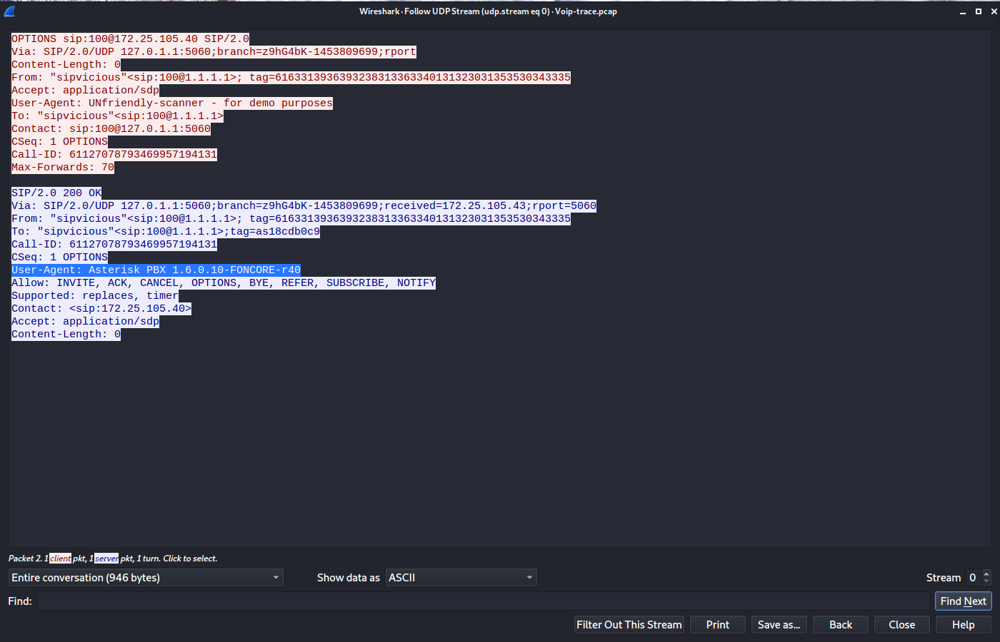
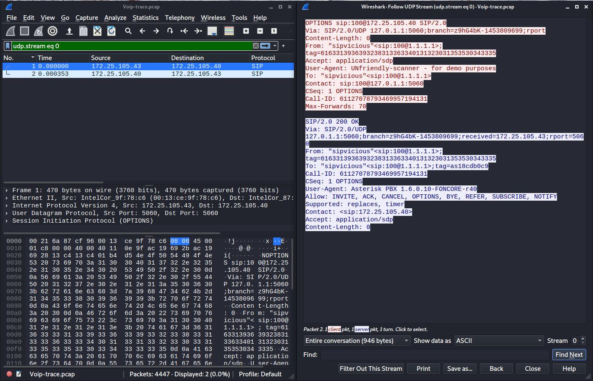
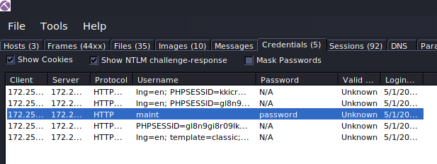
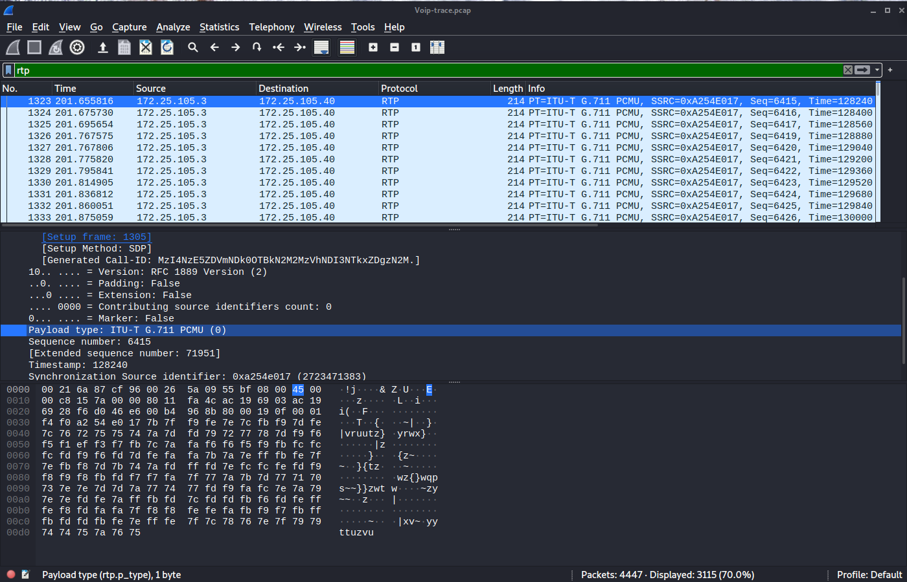

# Author:Panagiotis Fiskilis/Neuro

## Challenge name:CyberDefenders:Acoustic ##

### Description: ###

```
This challenge takes you into the world of voice communications on the internet. VoIP is becoming the de-facto standard for voice communication. As this technology becomes more common, malicious parties have more opportunities and stronger motives to control these systems to conduct nefarious activities. This challenge was designed to examine and explore some of the attributes of the SIP and RTP protocols.
```

## Flags: ##

- Flag 1:```udp```

The <code>SIP</code> protocol is using udp as the default transport protocol

- Flag 2:```SIPVicious```

Very common for SIP protocol attacks and scans

- Flag 3:```Asterisk PBX 1.6.0.10-FONCORE-r40```

We can find the victim's user-agent with the abduction method if we find the attacker's user-agent which is standard due to the tool that the attacker is using we can clearly say that in a 2 member connectionthe other user agent belongs to the victim



- Flag 4:```svcrack.py```

We use the filter <code>sip</code> and find that the attacker fuzzed some ips and extensions this kind of attack is commonly made with svgcrack

- Flag 5:```100```

We use filter <code>sip</code> and see that the first extension from the <code>[100,101,102,103,111]</code> range (extension 100) has no authentication and accepted the attacker's connection



- Flag 6:```2652```

I used the following bash oneliner:

```bash
cat log.txt |grep -A 10 "friendly-scanner" |grep "To:" >file
```

To create a parsable file format called file and wrote the <code>solver_6.py</code> script to parse and count the entries:

```python
#!/usr/bin/python3
extensions=list()
with open("file","r") as f:
    for Line in f.readlines():
        data=(Line.split("<sip")[0]).split("\"")[1]
        #print(data)
        if data not in extensions:
            extensions.append(data)
print(len(extensions))
```

Important note this script will count 2653 entries in reality we find only 2652 that's caused from the way that I chose to read the file.

- Flag 7:```Zoiper rev.6751```

```bash
cat log.txt |grep "User-Agent" |grep -v "friendly-scanner" |head -1
```

- Flag 8:```00112524021```

```bash
cat log.txt |grep -B 10 "User-Agent: Zoiper rev.6751" |grep -B 6 -A 6 "From:" |grep "INVITE sip:"|tail -1

OR

cat log.txt |grep -B 10 "User-Agent: Zoiper rev.6751"|grep -B 5 "From: .Unknown.<sip:101" |grep  "INVITE"|tail -1
```

- Flag 9:```maint:password```

Used <code>NetworkMiner</code> in the credentials section:



- Flag 11:```ITU-T G.711 PCMU```

We use the <code>rtp</code> in wireshark and search in the <code>payload type</code>



- Flag 12:```0.125```

used the most common sampling time as mentioned in the G.711 wikipedia page:

```
https://en.wikipedia.org/wiki/G.711
```

- Flag 13:```1234```

```bash
sipdump -p Voip-trace.pcap dump
sipcrack dump -w /opt/1337/rockyou.txt
```

- Flag 14:```timestamp```

Found the RFC for the rtp protocol:

```
https://datatracker.ietf.org/doc/html/rfc3550#page-13
```

- Flag 15:```MEXICO```

We use <code>Wireshark</code>&#8594;<code>Telephony</code>&#8594;<code>RTP</code>&#8594;<code>RTPStreams</code>

Select the first stream &#8594; <code>Analyze</code>&#8594;<code>Play Streams</code>

And good luck because the sound quality is bad
