# Author: Panagiotis Fiskilis/Neuro #

## Challenge name: CyberDefenders: BSidesJeddah-Part1 ##

### Description: ###

```
As a security consultant, a phishing attack attributed to a popular APT group targeted one of your customers.  Given the provided PCAP trace, analyze the attack and answer challenge questions.
```

#### Enum: ####

Stream:1213:Shellcode

Stream:1223:Cab file with PE file inside

```
We get the stream_1223.cab file, we run Foremost and get a ddl file
```


# Flags: #

- Flag 1:```00:0c:29:b7:ca:91```

filter: <code>tcp.stream eq 1247</code>

The attacker scanned the victim host

- Flag 2:```3401 Hillview Avenue Palo Alto CA 94304 US```

Google for: <code>00:0c:29</code>

and get: <code>https://hwaddress.com/oui-iab/00-0C-29/</code>

OR

Just google for VMware Inc address

- Flag 3:```192.168.112.128```

filter: <code>tcp.stream eq 17</code>

This is a scan traffic(from nmap)

- Flag 4:```192.168.112.2```

```bash
tshark -r e3.pcap -Y 'dns' |grep "192.168.112.139"
```

The victim only used one DNS server

- Flag 5:```omextemplates.content.office.net```

```bash
tshark -r e3.pcap -Y 'dns' |grep "192.168.112.139" |grep "5648"
```

- Flag 6:```64089e29f386356f1ffbd64d7056ca0f1d489a09cd7ebda630f2b7394e319406```

```bash
tshark -r e3.pcap -Y 'tls.handshake.session_id == 73:13:00:00:24:37:c1:7b:df:a2:59:3d:d0:e0:b2:8d:39:1e:68:0f:76:4b:5d:b3:c4:05:9f:7a:ba:db:b2:8e'
```

We get the right packet: <code>2739</code>

And via wireshark we read the public key

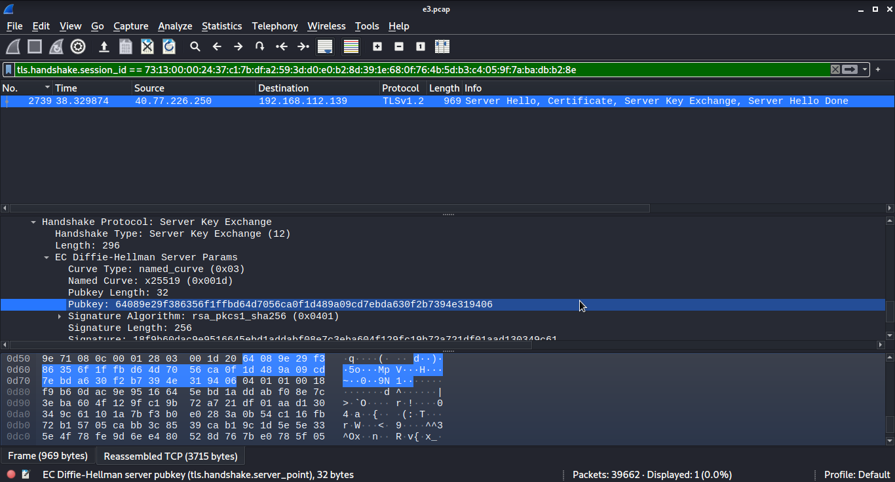

- Flag 7:```v10.vortex-win.data.microsoft.com```

```bash
tshark -r e3.pcap |grep "192.168.112.139" |grep "^ 4085" |head -1
```

We find the destination ipv4: <code>40.77.226.250</code>

Then we use wireshark with the filter: <code>ip.addr == 40.77.226.250</code>

We follow the TCP stream and get the flag

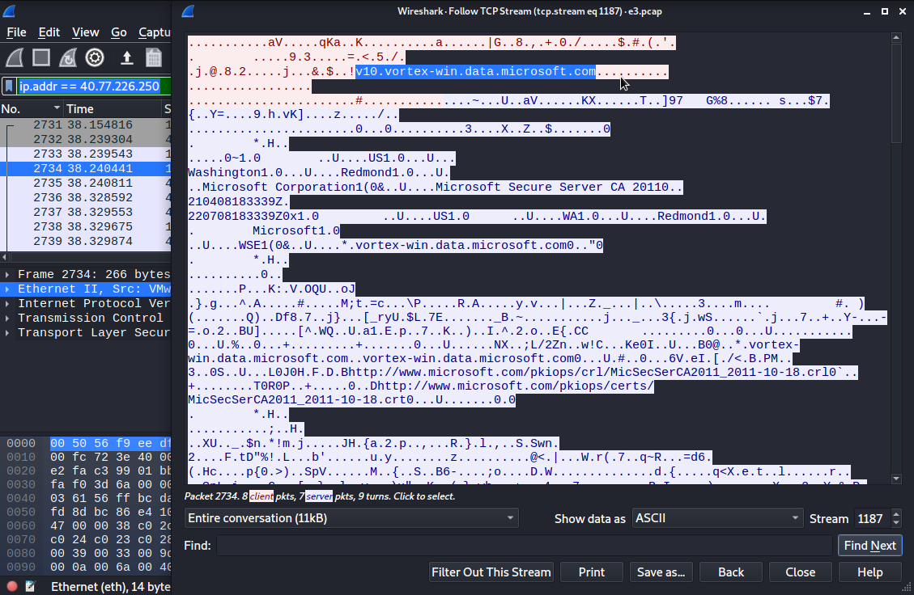

- Flag 8:```7```

```bash
tshark -r e3.pcap -Y "ip.dst==192.168.112.139 and ip.src==192.168.112.128" |grep "RST, ACK"|grep -v "443" |wc -l
```

The attacker did a SYN(or silent) scan so we have to find the reset flaged connections

- Flag 9:```CVE-2020-11899```

```bash
suricata -s Rules/suricata.rules -r ./e3.pcap
```

- Flag 10:```kali```

```bash
tshark -r e3.pcap |grep "^ 2650"
```

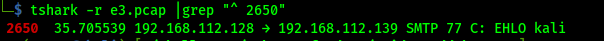

- Flag 11:```1183```

We use wireshark and filter: <code>smtp</code>

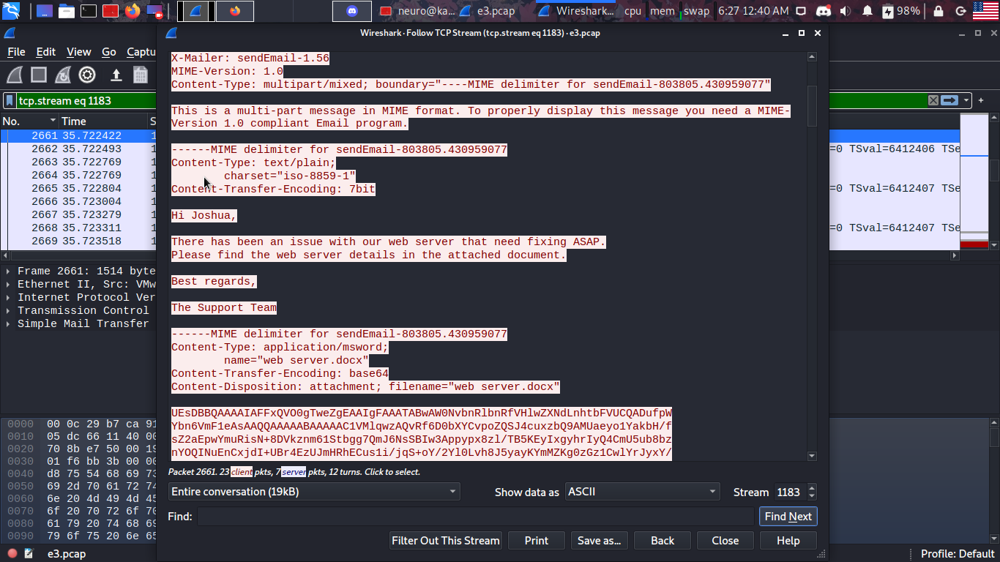

- Flag 12:```joshua@cyberdefenders.org```

```bash
tshark -r e3.pcap -Y 'smtp' |grep "@"
```

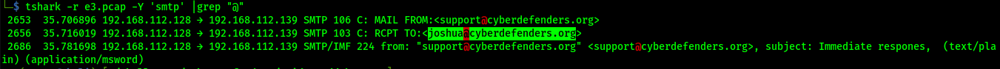

- Flag 13:```12:31:54```

Read answer for flag 11 and 12

- Flag 14:```1.56```

Read answer for flag 11, 12 and 13

- Flag 15:```55e7660d9b21ba07fc34630d49445030```

We extract a base64 encoded file from the email, we decode it and get the md5sum

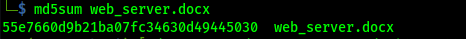

- Flag 16:```CVE-2021-40444```

We sumbit the file for analysis on virus total:

```
https://www.virustotal.com/gui/file/c7073b7fc18b3ec20e476a7375e2a6695d273f671917a6627430e59534d3a138
```

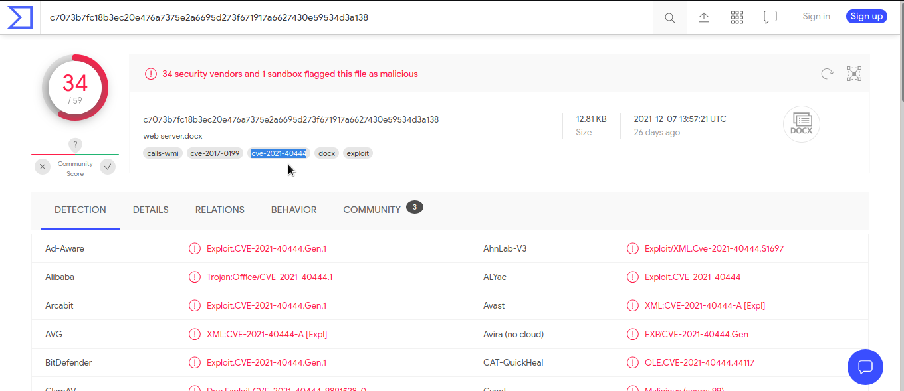

- Flag 17:```http://192.168.112.128/word.html```

Again from virustotal we find the IOCs

- Flag 18:```EnhancedMetaFile```

```bash
unzip web_server.docx
cat word/document.xml |grep -i 'link'
```

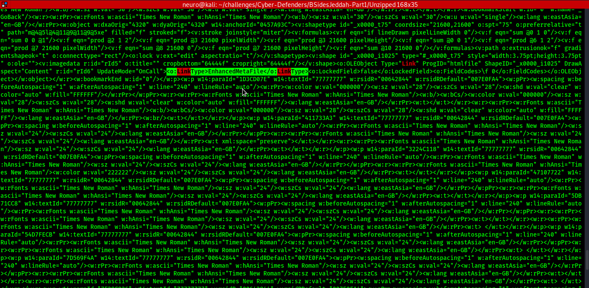

- Flag 19:```15.0.4517```

Inside stream: <code>1211</code> We can find the User-Agent and get the flag

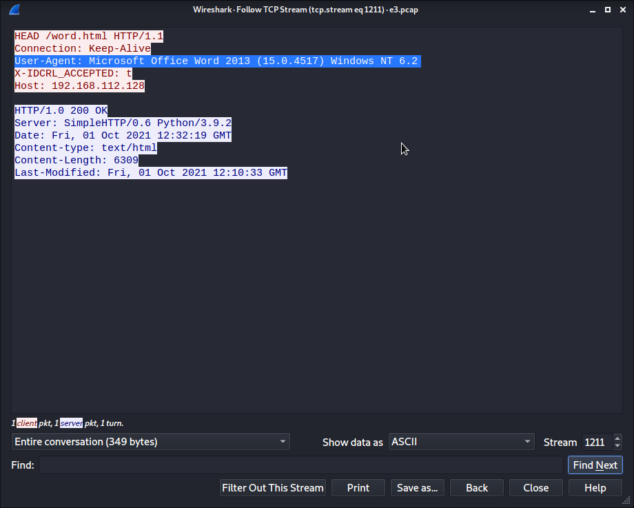

- Flag 20:```http://192.168.112.128/word.cab```

From virustotal and hybrid analysis we find that the malicious word document uses a malicious HTML file <code>word.html</code>

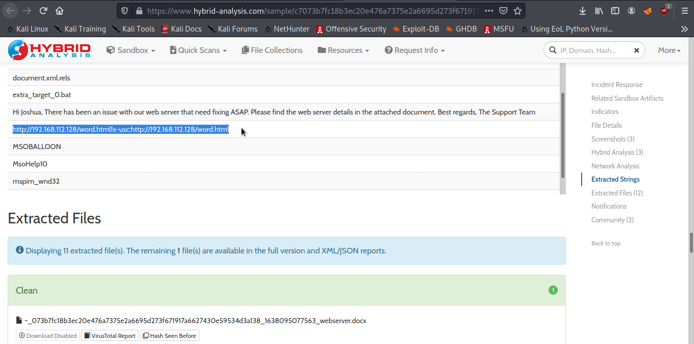

Then we extracted from wireshark the word.html file and found the link

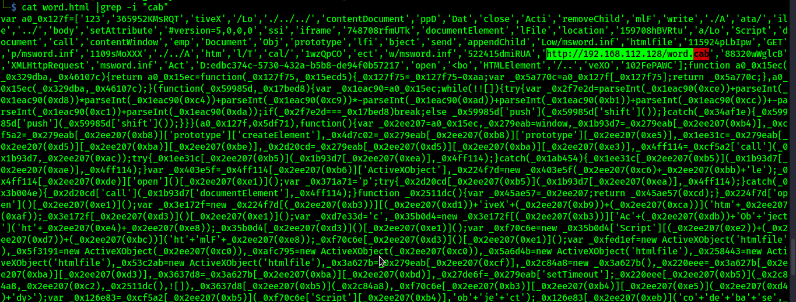

- Flag 21:```zipslip```

After some googling for the <code>CVE-2021-40444</code>

I found this GitHub repo:

```
https://github.com/klezVirus/CVE-2021-40444
```

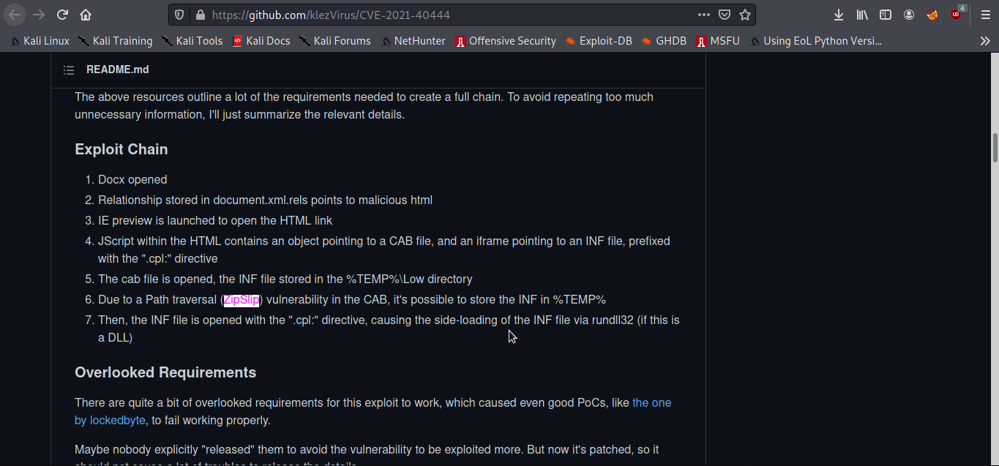

- Flag 22:```metasploit```

We upload the dll on virustotal and get this report:

```
https://www.virustotal.com/gui/file/c41baa9b9d0b3c693f2c4e8ab8132df87eb8d48fe8b090bdf504f1f45433e147/detection
```

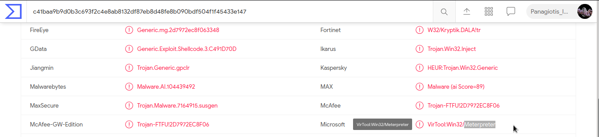

The file is detected as meterpreter wich means metasploit

- Flag 23:```C:\Users\IEUser\Appdata\Local\Temp\msword.inf```

I found a js deobfuscator here:

```
https://lelinhtinh.github.io/de4js/
```

- Flag 24:```WriteProcessMemory```

Did some static analysis

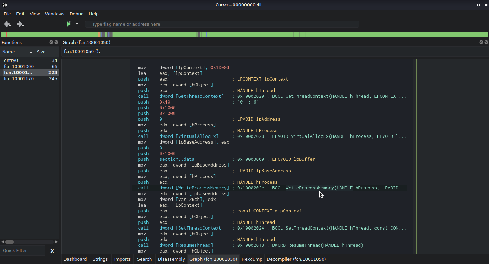

<b>NOTE: </b> Do not use a decompiler, the dll is obfuscated

- Flag 25:```wininet```

Used strings to find the flag reversed

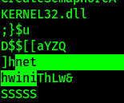

- Flag 26:```443```

Uploaded the file on virustotal
