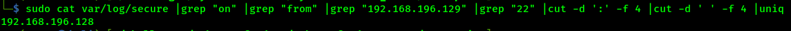

# Author:Panagiotis Fiskilis/Neuro #

## Challenge name: CyberDefenders:CyberDefenders CTF01 ##

### Description: ###

```
The enterprise EDR alerted for possible exfiltration attempts originating from a developer RedHat Linux machine. A fellow SOC member captured a disk image for the suspected machine and sent it for you to analyze and identify the attacker's footprints.
```

#### Enumeration: ####

```bash
file 02.E01
mkdir exp
sudo chomd 777 ./exp
ewfmount 02.E01 ./exp/
mkdir mountpoint
sudo mount -o loop,ro ./exp/ewf ./mountpoint/
cd mountpoint
```

We have to investigate a <code>EWF/Expert Witness/EnCase image file format</code> (Disk Forensics)

From the first flag we know that we have to deal with RedHat Linux

# Flags: #

- Flag1:```8.4```

```bash
cat etc/os-release
```


- Flag2:```6```

```
cat etc/passwd |grep "sh$"
cat etc/passwd |grep "sh$" |wc -l
```


- Flag3:```2```

```bash
sudo cat etc/sudoers |grep "wheel"
cat etc/group |grep "wheel"
```


- Flag4:```rachelgreen```

```bash
sudo unshadow etc/passwd etc/shadow ../unshadowed
echo "rossatron:$6$VXPKT.St9Jp0S2FH$EKA.JwvuEIT175KLTbZS61sEsOz6vDbeh5/2iFDfpm3.roox5WYt999a4hrYcTXNfnEoLnWJuC4xo0NPmBirl0:1001:1001::/home/rossatron:/bin/bash" >../rossatron_hash
john ../rossatron_hash --wordlist /opt/1337/rockyou.txt
```

- Flag5:```192.168.196.129```

```bash
sudo cat var/log/secure
sudo cat var/log/secure |grep "on" |grep "from"
```


- Flag6:```ssh```

```bash
sudo cat var/log/secure |grep "on" |grep "from" |grep "192.168.196.129" |grep "22"
```

- Flag7:

```bash
sudo cat var/log/secure |grep "on" |grep "from" |grep "192.168.196.129" |grep "22" |cut -d ':' -f 4 |cut -d ' ' -f 4 |uniq
```



- Flag8:```brute-force```

Only from the <code>var/log/secure</code> We can find that the attacker used brute-force to gain access

- Flag9:```2```

```bash
sudo cat var/log/secure |grep "Accepted password" |grep "192.168.196.128"
```


- Flag10:```23/08/2021```

```bash
sudo cat var/log/secure |grep "Accepted password" |grep "192.168.196.128"
```


- Flag11:```chandler```

```bash
sudo cat var/log/secure |grep "192.168.196.128" |grep "Accepted password" |head -2
```

- Flag12:```T1098.004```

The attacker added his public key on the <code>authorized_keys</code> file inside chandler's .ssh directory to acchieve persistence

```bash
cd home
ls -la -r ./* |grep "ssh"
ls -la -r ./*
cd chandler/.ssh
cat authorized_keys
```


```
https://attack.mitre.org/techniques/T1098/004/
```

- Flag13:```CVE-2021-3560```

```bash
cat home/chandler/.bash_history
```

The attacker used the dbus gtfo bin

I searched for <code>dbus cve 2021 gtfobin</code> and found this:

```
https://github.blog/2021-06-10-privilege-escalation-polkit-root-on-linux-with-bug/
```

- Flag14:

We have a pythoneer attacker:

```bash
ls bin/ |grep "py"
cat bin/c2c.py |grep "mail"
```

- Flag15:```HAVEAGOOOODDAY```

```bash
ls -la -r ./* |grep "*.py"
cd home/
ls -la -r ./* |grep "xfil.txt"
cat rache/xfil.txt
```

We get the word: <code>iof5</code>, which is a part of the link for a termbin:

```
http://termbin.com/iof5
```

The termbin gives a 404. I searched on the wayback machine and got a snapshot:

```
https://web.archive.org/web/20210825050145/http://termbin.com/iof5
```

Finally used a simple keyloger decoder and got the following:

```
YOUR SECRET IS HAVEAGOOOODDAY
```


