<h1>Author: Panagiotis Fiskilis/Neuro</h1>

<h2>Challenge name: CyberDefenders: Detect Log4J</h2>

<h3>Description:</h3>

```
For the last week, log4shell vulnerability has been gaining much attention not for its ability to execute arbitrary commands on the vulnerable system but for the wide range of products that depend on the log4j library. Many of them are not known till now. We created a challenge to test your ability to detect, analyze, mitigate and patch products vulnerable to log4shell.
```

<h3>Flags:</h3>

- Flag 1: `VCW65`

Q: <code>What is the computer hostname?</code>

We used <code>FTK Imager on the EWF file</code> and navigated on:

```
C:\Windows\System32\config\SYSTEM
```

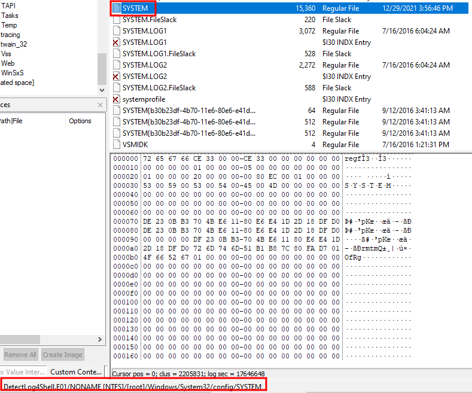

We export the registry and open the file using <code>Registry Viwer</code>

We navigated on:

```
SYSTEM/ControlSet001/Control/ComputerName/ComputerName
```

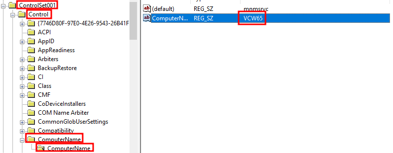

- Flag 2: `UTC-8`

Q: <code>What is the Timezone of the compromised machine?</code>

To find the Timezone on the above mentioned `SYSTEM` registry we navigate to:

```
SYSTEM/ControlSet001/Control/TimeZoneInformation/TimeZoneKeyName
```

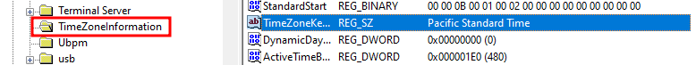

PST is UTC-8

- Flag 3: `14393`

Q: <code>What is the current build number on the system?</code>

The build number is stored on the <code>SOFTWARE registry</code>:

```
C:\System32\config\SOFTWARE
```

We export the registry and then open it with <code>RegistryViwer</code>

We navigate to:

```
SOFTWARE/Microsoft/Windows NT/CurrentVersion
```

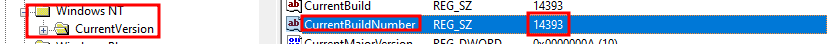

- Flag 4: `192.168.112.139`

Q: <code>What is the computer IP?</code>

We navigate to:

```
SYSTEM/ControlSet001/Services/TCPip/Parameters/Interfaces/
```

We found 3 Interfaces/3-SIDs:

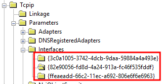

After enumerating the NICs we found that the 2nd one had Networking settings configured:

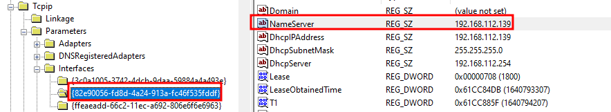

- Flag 5:`cyberdefenders.org`

Q: <code>What is the domain computer was assigned to?</code>

We navigate to:

```
SYSTEM/ControlSet001/Services/TCPip/Parameters/
```

There we found the registry value <code>NV Domain</code>

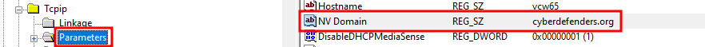

- Flag 6: `2021-12-28 06:57:23 UTC`

Q: <code>When was myoussef user created?</code>

To find User account information we will extract the <code>SAM</code> registry from:

```
C:\Windows\System32\config
```

And use <code>regripper</code>

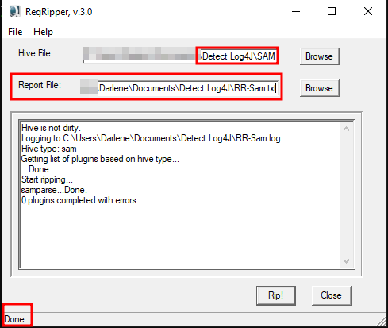

We open <code>notepad++</code> and search for the user: `myoussef`:

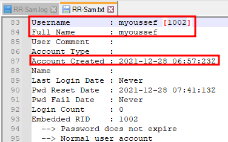

- Flag 7: `https://www.linkedin.com/in/0xmohamedhasan/`

Q: <code>What is the user mhasan password hint?</code>

We will use `Autopsy` and use the `OS Accounts` tab:

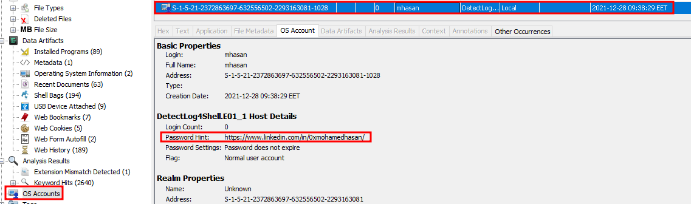

- Flag 8: `6.7.0.40322`

Q: <code>What is the version of the VMware product installed on the machine?</code>

<i>NOTE: The question is about VMware VCenter NOT VSphere.</i>

Information about any installed software is stored on the `SOFTWARE` registry.

We navigate to:

```
SOFTWARE/VMware, Inc./VCenterServer/
```

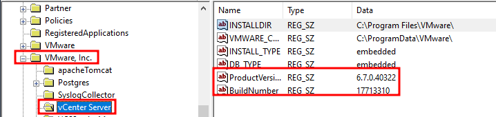

- Flag 9: `2.11.2`

Q: <code>What is the version of the log4j library used by the installed VMware product?</code>

The JAR files are packed with the `VMware` application and they are in the same folder.

We navigate to:

```
C:\Program Files\VMware\VCenterServer\commonjars\
```

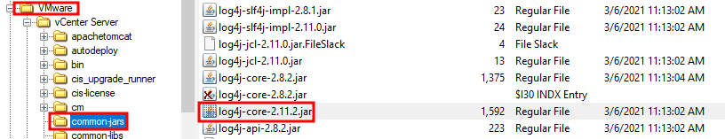

- Flag 10: `info`

Q: <code>What is the log4j library log level specified in the configuration file?</code>

We will use <code>Autopsy</code> on Windows 10,

We will search the files for `Log4j`, then we sort the filenames and find the `Log4j.properties` file:

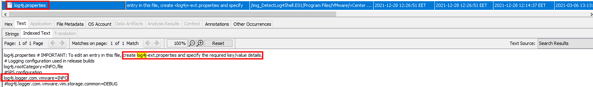

- Flag 11: `X-Forwarded-For`

Q: <code>The attacker exploited log4shell through an HTTP login request. What is the HTTP header used to inject payload?</code>

The <code>X-Forwarded-For</code> header is a common header used to perform the Log4-Shell exploit.

- Flag 12: `log4shell.huntress.com:1389/b1292f3c-a652-4240-8fb4-59c43141f55a`

Q: <code>The attacker used the log4shell.huntress.com payload to detect if vcenter instance is vulnerable. What is the first link of the log4huntress payload?</code>

We found the payload from `Huntress` here:

```
https://log4shell.huntress.com/
```

Then we used the search functionality of `Autopsy` for:

```
log4shell.huntress.com
```

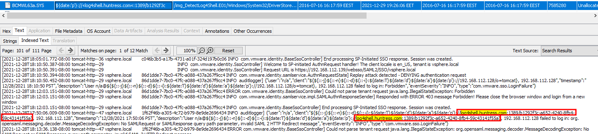

- Flag 13:

Q: <code>When was the first successful login to vsphere WebClient?</code>

- Flag 14:

Q: <code>What is the attacker's IP address?</code>

- Flag 15:

Q: <code>What is the port the attacker used to receive the cobalt strike reverse shell?</code>

- Flag 16:

Q: <code>What is the script name published by VMware to mitigate log4shell vulnerability?</code>

- Flag 17:

Q: <code>In some cases, you may not be able to update the products used in your network. What is the system property needed to set to 'true' to work around the log4shell vulnerability?</code>

- Flag 18:

Q: <code>What is the log4j version which contains a patch to CVE-2021-44228?</code>

- Flag 19:

Q: <code>Removing JNDIlookup.class may help in mitigating log4shell. What is the sha256 hash of the JNDILookup.class?</code>

- Flag 20:

Q: <code>Analyze JNDILookup.class. What is the value stored in the CONTAINER_JNDI_RESOURCE_PATH_PREFIX variable?</code>

- Flag 21:

Q: <code>What is the executable used by the attacker to gain persistence?</code>

- Flag 22:

Q: <code>When was the first submission of ransomware to virustotal?</code>

- Flag 23:

Q: <code>The ransomware downloads a text file from an external server. What is the key used to decrypt the URL?</code>

- Flag 24:

Q: <code>What is the ISP that owns that IP that serves the text file?</code>

- Flag 25:

Q: <code>The ransomware check for extensions to exclude them from the encryption process. What is the second extension the ransomware checks for?</code>
