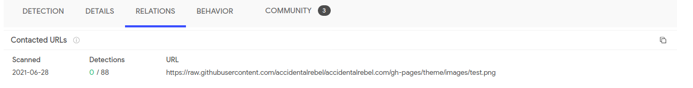

# Author:Panagiotis Fiskilis/Neuro

# Challenge name:Cyber Defenders:Emprisa Maldoc

Notes:

The File is a malicious RTF file

We do a simple recon with strings and xxd and finally we use any.run and Virus total to open the file for some dynamic analysis

```
https://app.any.run/tasks/643d16fb-7580-4ae7-bf10-b9fd577ee868
https://www.virustotal.com/gui/file/8f7f608a4104f2e9952f0bde07bb17187758fea0d0c53ded45cd537758c045a9/detection
```

We also perform dynamic analysis with <code>ftrdump,rtfobj</code> in order to see the macros and embedded shellcode.

By doing some simple detective/OSINT work we can guess that the file uses the CVE-2017-11882

Solution:

```bash
file c39-EmprisaMaldoc.rtf
xxd c39-EmprisaMaldoc.rtf
```

Flags:

- Flag1:CVE-2017-11882

```
We use Virus total and find the CVE from the scanners
```
- Flag2:KB4011604

```
https://www.fireeye.com/blog/threat-research/2017/12/targeted-attack-in-middle-east-by-apt34.html
https://msrc.microsoft.com/update-guide/vulnerability/CVE-2017-11882
```

- Flag3:d0cf11e0

```python3
python3 rtfdump.py -O c39-EmprisaMaldoc.rtf
```

```
https://neil-fox.github.io/RTF-Analysis-&-Lokibot/
```

- Flag4:eqnedt32.exe


- Flag5:"C:\o.exe"

We see that the path starts with <code>c:/o</code> and the type of the file ".exe" is on the back of the dump


- Flag6:test.png

```
https://raw.githubusercontent.com/accidentalrebel/accidentalrebel.com/gh-pages/theme/images/test.png
```



- Flag7:cotizacin

```bash
wget https://raw.githubusercontent.com/accidentalrebel/accidentalrebel.com/gh-pages/theme/images/test.png
strings /tmp/test.png |grep "c" |grep "n" |grep "flag"
```


- Flag8:Equation Native

```bash
rtfdump -s 7 -a -d c39-EmprisaMaldoc.rtf >shellcode.bin
```

```bash
cat shellcode.bin
```

Used Cyber chef:

```
https://tinyurl.com/m2fhvkyr
```

And decode the hex values


- Flag9:URLDownloadToFileA

As a common function used on windows to download files.

- Flag10:WinExec

As a common function used on windows for execution.

- Flag11:urlmon.dll

Used the Any.run report and found that it downloaded the urlmon.dll file for OLE files

```
https://www.processlibrary.com/en/directory/files/urlmon/19481/
```


- Flag12:Times New Roman

```bash
cat c39-EmprisaMaldoc.rtf
```

Get the last part of the shellcode and hex decode it.

```
https://tinyurl.com/aymahdux
```

- Flag13:https://github.com/unamer/CVE-2017-11882

Searched for the obvious: <code>CVE-2017-11882 tool github</code>

```
https://github.com/unamer/CVE-2017-11882
```

- Flag14:0x00402114

Got it from github:

```
https://raw.githubusercontent.com/unamer/CVE-2017-11882/master/CVE-2017-11882.py
```
