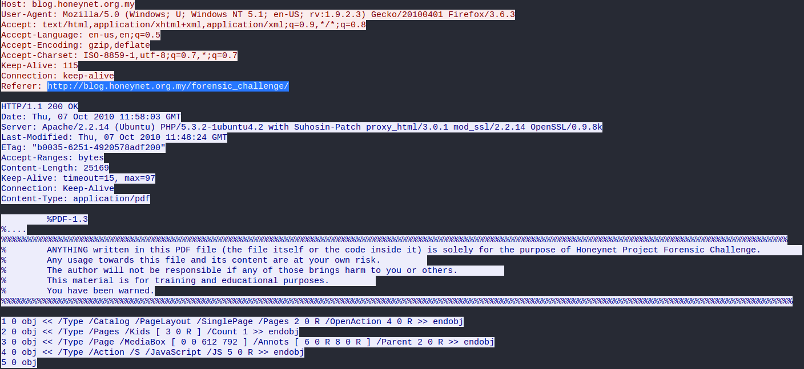
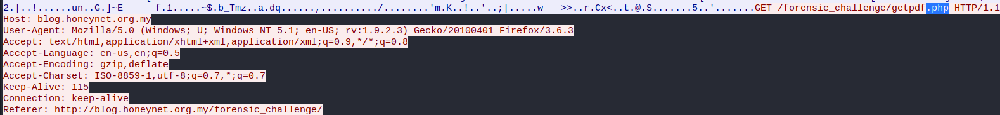
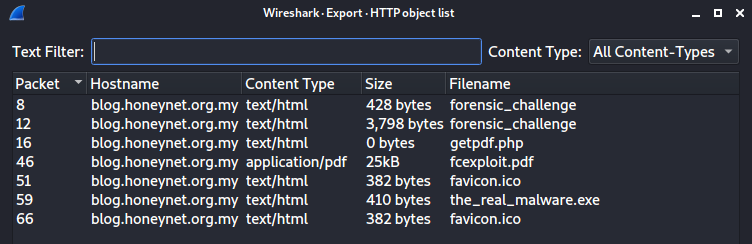
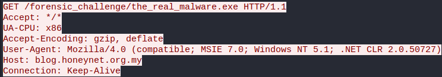

<h1>Author: Panagiotis Fiskilis/Neuro</h1>

<h2>Challenge: CyberDefenders: GetPDF</h2>

<h3>Description:</h3>

```
PDF format is the de-facto standard in exchanging documents online. Such popularity, however, has also attracted cyber criminals in spreading malware to unsuspecting users. The ability to generate malicious pdf files to distribute malware is a functionality that has been built into many exploit kits. As users are less cautious about opening PDF files, the malicious PDF file has become quite a successful attack vector. The network traffic is captured in lala.pcap contains network traffic related to a typical malicious PDF file attack, in which an unsuspecting user opens a compromised web page, which redirects the user’s web browser to a URL of a malicious PDF file. As the PDF plug-in of the browser opens the PDF, the unpatched version of Adobe Acrobat Reader is exploited and, as a result, downloads and silently installs malware on the user’s machine.
```

<h3>Flags:</h3>

- Flag 1:```6```

Q: <code>How many URL path(s) are involved in this incident?</code>

```bash
tshark -r ./lala.pcap -Y "http.request" #We find 2 requests at the same endpoint so we decrease by one the next result.
tshark -r ./lala.pcap -Y "http.request" |wc -l #We find it is 7 so we decrease to 6 from the previous comment.
```

- Flag 2:```http://blog.honeynet.org.my/forensic_challenge/```

Q: <code>What is the URL which contains the JS code?</code>



- Flag 3:```http://blog.honeynet.org.my/forensic_challenge/getpdf.php```

Q: <code>What is the URL hidden in the JS code?</code>

```bash
pdfid fcexploit.pdf |grep -i "JS\|javascript"
echo "extract js > all-javascripts-from-my.pdf" >xtract.txt
/opt/peepdf/peepdf.py -l -f -s /opt/peepdf/xtract.txt ./HTTP_objs/fcexploit.pdf
```

Unhex the payload or check the packet capture for the fect request.



- Flag 4:```659cf4c6baa87b082227540047538c2a```

Q: <code>What is the MD5 hash of the PDF file contained in the packet?</code>

Export all the http objects from the pcap and see the files.



```bash
md5sum fcexploit.pdf
```

- Flag 5:```19```

Q: <code>How many object(s) are contained inside the PDF file?</code>

```bash
pdfid fcexploit.pdf |grep -i "obj"
pdfid fcexploit.pdf |grep -i "obj" |head -1
```

- Flag 6:```4```

Q: <code>How many filtering schemes are used for the object streams?</code>

```bash
pdf-parser fcexploit.pdf |grep -i "filter"
pdf-parser fcexploit.pdf |grep -i "filter" |wc -l
```

- Flag 7:```5```

Q: <code>What is the number of the 'object stream' that might contain malicious JS code?</code>

Used pdfstreamdumper to analyse the pdf

```
https://github.com/dzzie/pdfstreamdumper
```

- Flag 8:```7,9```

Q: <code>Analyzing the PDF file. What 'object-streams' contain the JS code responsible for executing the shellcodes? The JS code is divided into two streams. Format: two numbers separated with ','. Put the numbers in ascending order</code>

We used pdfstreamdumper and found the peculiar streams.

- Flag 9:```C:\Windows\System32\a.exe```

Q: <code>The JS code responsible for executing the exploit contains shellcodes that drop malicious executable files. What is the full path of malicious executable files after being dropped by the malware on the victim machine?</code>

I found the name of the file from virus total and pdfstreamdumper and the rest of the path is very common path for Windows malware.

- Flag 10:```http://blog.honeynet.org.my/forensic_challenge/the_real_malware.exe```

Q: <code>The PDF file contains another exploit related to CVE-2010-0188. What is the URL of the malicious executable that the shellcode associated with this exploit drop?</code>



- Flag 11:```5```

Q: <code>How many CVEs are included in the PDF file?</code>

Inside the 2 exploit streams(7,9) we can identify with virus total 4 CVEs+1 CVE from the prompt
