# Author: Panagiotis Fiskilis/Neuro

## Challenge name: Cyber Defenders:Hacked ##

## Description: ##

```
You have been called to analyze a compromised Linux web server. Figure out how the threat actor gained access, what modifications were applied to the system, and what persistent techniques were utilized. (e.g. backdoors, users, sessions, etc).
```

# Flags:

- Flag 1:```Europe/Brussels```

We found the <code>/etc/timezone</code> file

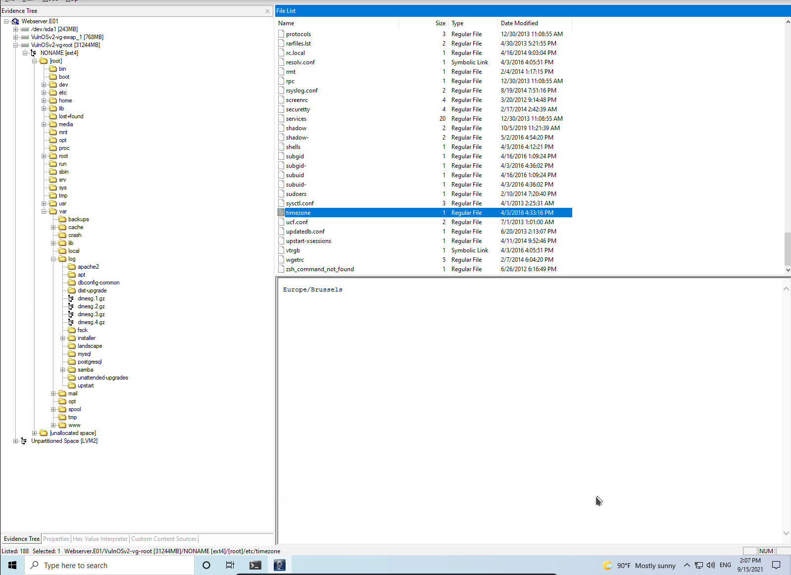

- Flag 2:```mail```

We export the <code>wtmp</code> log file from ftk imager

We can find the login file on: <code>/var/log/wtmp</code>

and use:

```bash
last -f wtmp |grep "pts"
```

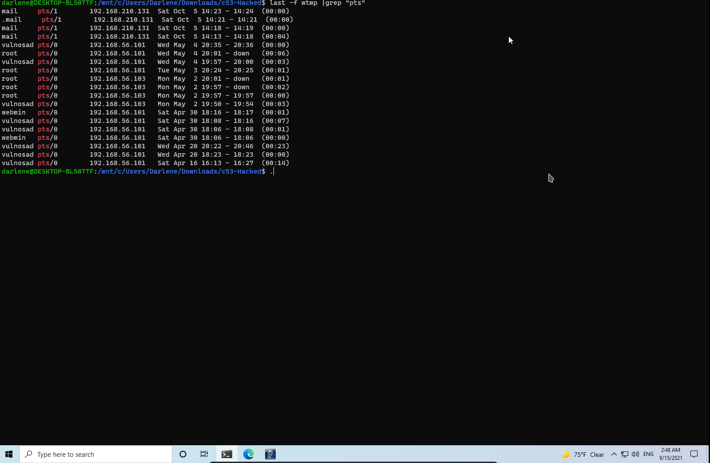

- Flag 3:```57708```

```bash
cat auth.log |grep "mail" |grep -i "port" |tail -1
```

- Flag 4:```1```

We can find the <code>access.log</code>

Inside the <code>/var/log/apache2/access.log</code> path

```bash
cat access.log|grep "mail"
```

- Flag 5:```sshd```

We get the <code>/var/log/btmp</code> file and use:

```bash
last -f btmp |tail
```

We can also get the flag from the <code>/var/auth.log</code>

- Flag 6:```bruteforce```

Inside the access.log,btmp files we find a lot attempts to connect <sub>That's a possible bruteforce attack</sub>:

```bash
cat access.log |cut -d "-" -f 3 |cut -d "]" -f 1
```

- Flag 7:```2```

We get the <code>lastlog</code> file from:

<code>/var/log/lastlog</code>

And use <code>Strings</code> to find the ips:

```bash
strings lastlog |grep "192" |wc -l
```

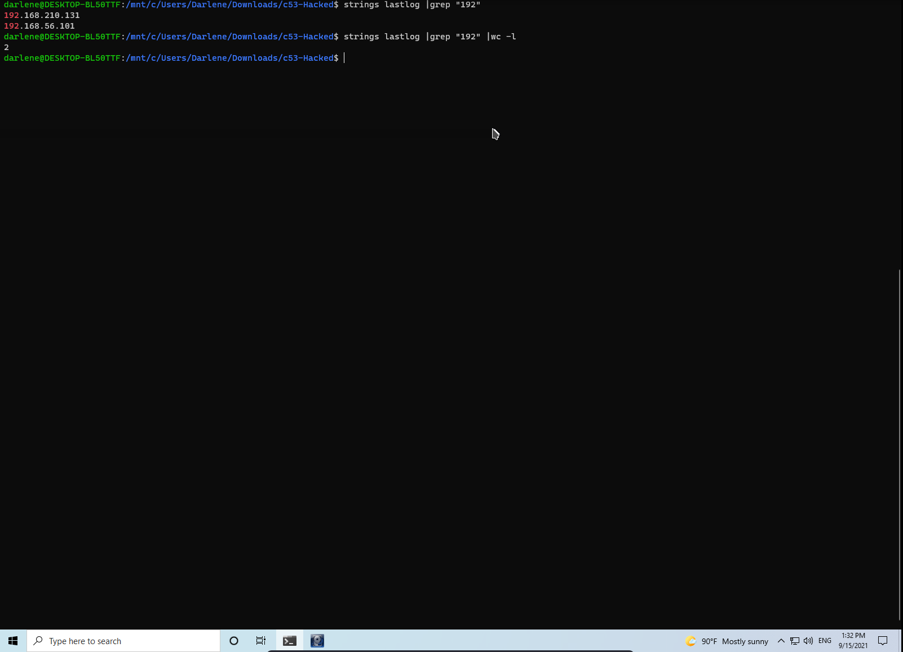

- Flag 8:```5```

We get the <code>/etc/passwd</code> file from the webserver disk and use the following command

```bash
cat passwd |grep -v "nologin" |grep "bash$" |wc -l
```

*NOTE:From a first look we see that users who have a shell only use bash that's why we grep for bash*

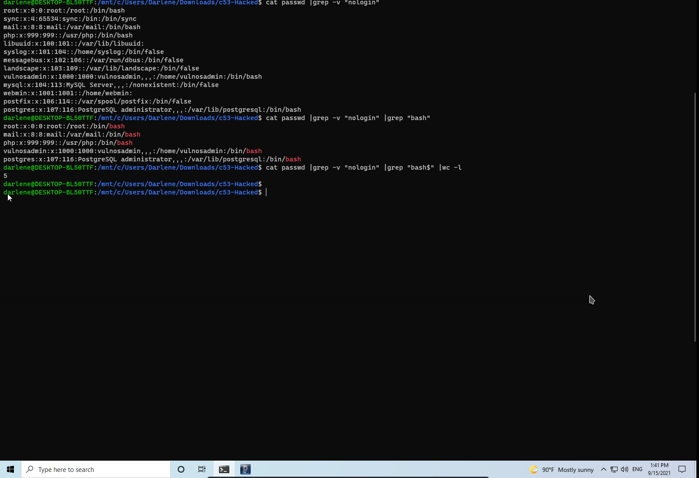

- Flag 9:```forensics```

We get the <code>/etc/shadow</code> file and use:

```bash
unshadow shadow shadow>unshadowed
john --wordlist=rockyou.txt unshadowed
```

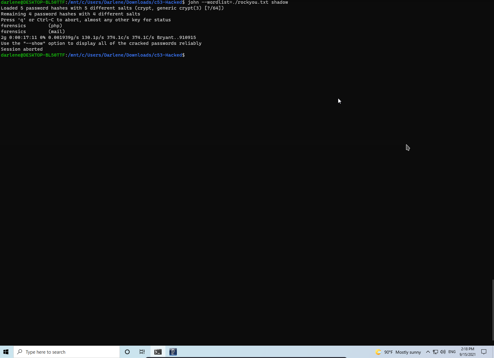

- Flag 10:```php```

The <code>phpMyadmin</code> documentation does not say anything about a new php user

- Flag 11:```58```

We get the <code>/etc/group</code> file and use:

```bash
cat group |wc -l
```

- Flag 12:```2```

We find the <code>/etc/sudoers</code> file

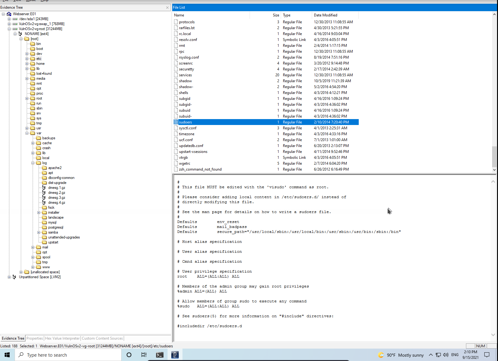

- Flag 13:```/usr/php```

We can find this flag with 2 ways:

1. - By accident:Inside this directory we find the <code>.bashrc,.bash_logout,.profile</code> files which are home direcotry files

2. - The normal way:From the passwd file

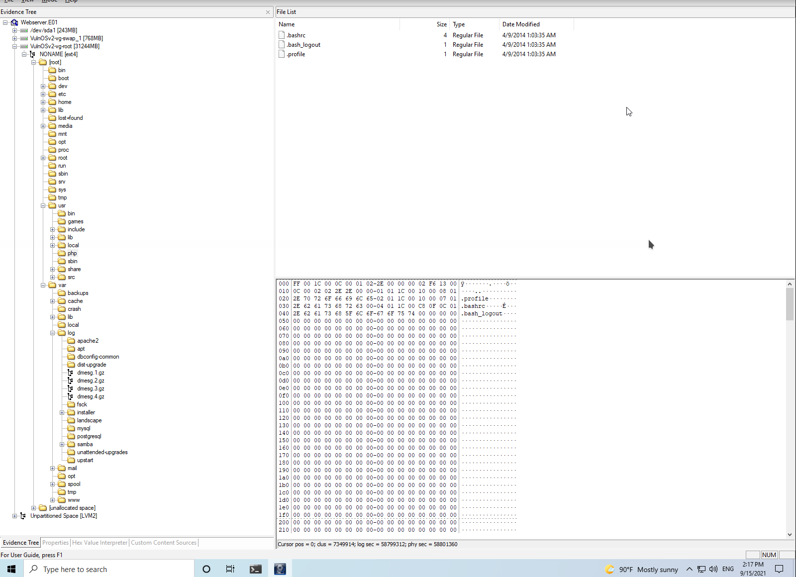

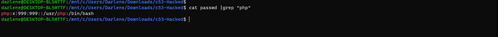

- Flag 14:```sudo su -```

We know that the attacker logged in as the user <code>mail</code>, we find the user's home direcotry at:<code>/var/mail</code> and get the user's <code>.bash_history</code>

- Flag 15:```37292.c```

Go to <code>/root/.bash_history</code>

- Flag 16:```rebel```

On /tmp/ we find the compiled binary of the exploitfile of question 15.

We *click* on it and Windows starts screaming:

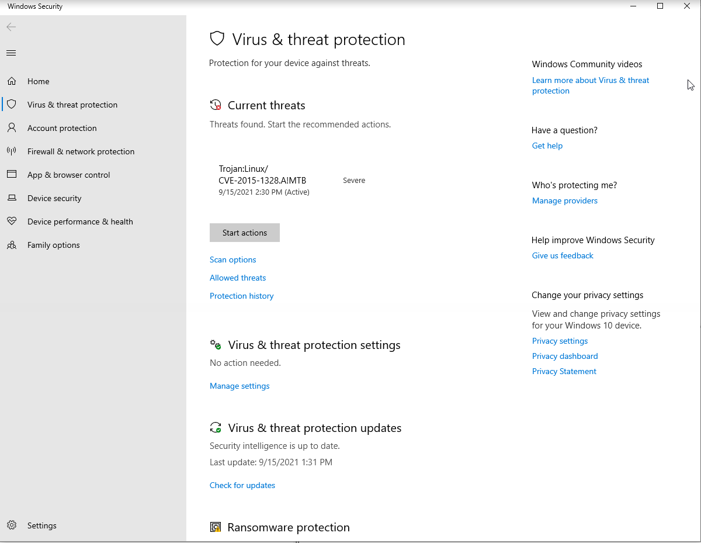

After that we know the CVE and search for it in exploit-db:

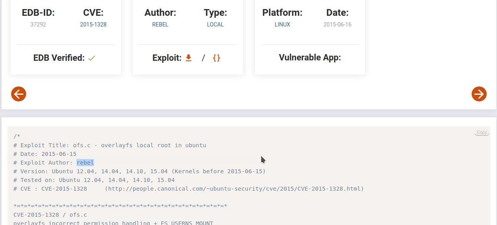

- Flag 17:```Drupal```

Found the <code>/etc/drupal</code> direcotry

- Flag 18:```7.28```

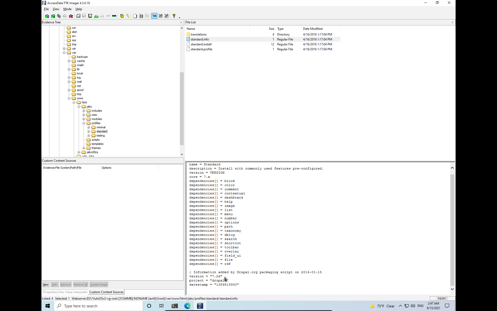

- Flag 19:```4444```

Common for metasploit framework

