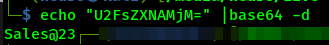

<h1>Author: Panagiotis Fiskilis/Neuro</h1>

<h2>Challenge name: CyberDefenders: HawkEye</h2>

<h3>Description:</h3>

```
An accountant at your organization received an email regarding an invoice with a download link. Suspicious network traffic was observed shortly after opening the email. As a SOC analyst, investigate the network trace and analyze exfiltration attempts.
```

<h3>Flags:</h3>

- Flag 1:```4003```

Q:<code>How many packets does the capture have?</code>

```bash
tshark -r ./stealer.pcap |wc -l
```


- Flag 2:```2019-04-10 20:37:07 UTC```

Q:<code>At what time was the first packet captured?</code>

```bash
tshark -r ./stealer.pcap -T fields -e frame.time|head -1
```

We got the following date in EEST: Apr 10, 2019 23:37:07.129730000 EEST

We can convert EEST to UTC by decreasing by 3 the hours and get:

```
Apr 10, 2019 20:37:07 UTC
```

Finally we parse to the flag format:

```
2019-04-10 20:37:07 UTC
```

- Flag 3:```01:03:41```

Q:<code>What is the duration of the capture?</code>

We will get the first and last timestamp(the first and last packet):

```bash
tshark -r ./stealer.pcap -T fields -e frame.time|head -1 #First packet
tshark -r ./stealer.pcap -T fields -e frame.time|tail -1 #Last packet
```

<i>NOTE:</i> We have to change the timestamps from EEST to UTC

```
Apr 10, 2019 23:37:07.129730000 EEST -> Apr 10, 2019 20:37:07 UTC
Apr 11, 2019 00:40:48.690963000 EEST -> Apr 11, 2019 21:40:48 UTC
```

We find the timestamp difference:

```
Wed Apr 10 22:40:48 2019 - Wed Apr 10 21:37:07 2019 = 1:03:41
```

- Flag 4:```00:08:02:1c:47:ae```

Q:<code>What is the most active computer at the link level?</code>

I found all the NICs inside the pcap, then I calculated the sum of packages.

Finally found for each NIC how many packages it sent and found the max number of packages.

```bash
tshark -r ./stealer.pcap -T fields -e eth.src_resolved |sort| uniq # Find all the network cards
tshark -r ./stealer.pcap -T fields -e eth.src_resolved | wc -l #4003
tshark -r ./stealer.pcap -T fields -e eth.src_resolved| grep -i "Netgear_b6:93:f1" | wc -l  #1776
tshark -r ./stealer.pcap -T fields -e eth.src_resolved| grep -i "Dell_c2:09:6a" | wc -l #234
tshark -r ./stealer.pcap -T fields -e eth.src_resolved| grep -i "HewlettP_1c:47:ae" | wc -l #1993
tshark -r ./stealer.pcap -T fields -e eth.src |sort |uniq |grep "1c:47:ae"
```

- Flag 5:```hewlett-packard```

Q:<code>Manufacturer of the NIC of the most active system at the link level?</code>

Read the solution for Flag 4 and do some googling

- Flag 6:```Palo Alto```

Q:<code>Where is the headquarter of the company that manufactured the NIC of the most active computer at the link level?</code>

Searched for:

```
hewlett-packard headquarters
```

- Flag 7:```3```

Q:<code>The organization works with private addressing and netmask /24. How many computers in the organization are involved in the capture?</code>

```bash
tshark -r ./stealer.pcap -T fields -e eth.src |sort |uniq |wc -l
```

- Flag 8:```BEIJING-5CD1-PC```

Q:<code>What is the name of the most active computer at the network level?</code>

I used <code>eth.addr == 00:08:02:1c:47:ae</code> as filter in wireshark and found the Kerberos packages with the host name:


- Flag 9:```10.4.10.4```

Q:<code>What is the IP of the organization's DNS server?</code>

We assumed that the dns server runs on port: 53(default DNS port) so we wrote the following oneliner and got the flag

```bash
tshark -r ./stealer.pcap -Y "dns" -T fields -e udp -e ip |grep "Src Port: 53," |uniq
```


- Flag 10:```proforma-invoices.com```

Q:<code>What domain is the victim asking about in packet 204?</code>

```bash
tshark -r ./stealer.pcap -Y "dns" |grep "204 "
```


- Flag 11:```217.182.138.150```

Q:<code>What is the IP of the domain in the previous question?</code>

```bash
tshark -r ./stealer.pcap -Y dns |grep "proforma-invoices.com"|grep -v "204"
```


- Flag 12:```France```

Q:<code>Indicate the country to which the IP in the previous section belongs.</code>

```bash
whois 217.182.138.150 |grep -i "addr"
```


- Flag 13:```Windows NT 6.1```

Q:<code>What operating system does the victim's computer run?</code>

```bash
strings stealer.pcap |grep -i -A 10 "Windows" |less
```


- Flag 14:```tkraw_Protected99.exe```

Q:<code>What is the name of the malicious file downloaded by the accountant?</code>

We searched for any suspicious files inside the capture and the only thing weird was the flag:


- Flag 15:```71826ba081e303866ce2a2534491a2f7```

Q:<code>What is the md5 hash of the downloaded file?</code>

```bash
md5sum tkraw_Protected99.exe
```


- Flag 16:```Spyware.HawkEyeKeyLogger```

Q:<code>What is the name of the malware according to Malwarebytes?</code>

Virus total passes the sample from Malwarebytes

Virus total Link:

```
https://www.virustotal.com/gui/file/62099532750dad1054b127689680c38590033fa0bdfa4fb40c7b4dcb2607fb11
```


- Flag 17:```LiteSpeed```

Q:<code>What software runs the webserver that hosts the malware?</code>

I used strings to find the raw HTTP request inside the pcap strings

```bash
strings stealer.pcap |grep -A 14 -B 1 "tkraw_Protected99.exe"
```


- Flag 18:```173.66.146.112```

Q:<code>What is the public IP of the victim's computer?</code>

I greped for the victim's private IP address <code>10.4.10.132</code> and found a weird base64 text

```bash
tshark -r ./stealer.pcap  |grep "10.4.10.132"
```


When I decoded the base64 I got the flag


While I was writing the write-up I tried to grep again for base64 text in general:

```bash
tshark -r ./stealer.pcap  |grep "10.4.10.132" |grep "=="
```

And noticed that all they all carry the same info:


- Flag 19:```United States```

Q:<code>In which country is the email server to which the stolen information is sent?</code>

From the previous task we can find the IP address of the email server <code>23.229.162.69</code>, so I searched for it:

```bash
whois 23.229.162.69 |grep -i "addr"
```


After a quick google search for:

```
14455 N Hayden Road
```

We get the flag


- Flag 20:```2014-02-08```

Q:<code>What is the domain's creation date to which the information is exfiltrated?</code>

Using the results from the following oneliner:

```bash
tshark -r ./stealer.pcap  |grep "10.4.10.132" |grep "==" #Used on task 18
```

We get the same base64 but when we decode all the information we find this encoded text:


We decode it and get a domain name: <code>macwinlogistics.in</code>


Then we use whois to get the flag:

```bash
whois macwinlogistics.in |grep -i "date"
```


- Flag 21:```Exim 4.91```

Q:<code>Analyzing the first extraction of information. What software runs the email server to which the stolen data is sent?</code>

```bash
tshark -r ./stealer.pcap -Y "smtp && ip.addr==10.4.10.132"
```


- Flag 22:```sales.del@macwinlogistics.in```

We use the oneliner from tasks: 18,20 and get the email:


Q:<code>To which email account is the stolen information sent?</code>

- Flag 23:```Sales@23```

Q:<code>What is the password used by the malware to send the email?</code>

We search for smtp traffic where the IP:10.4.10.132 is included:

```bash
tshark -r ./stealer.pcap -Y "smtp && ip.addr==10.4.10.132"
tshark -r ./stealer.pcap -Y "smtp && ip.addr==10.4.10.132" |grep -i "Pass" #We want SMTP traffic and grep for password that the attacker transfers
```

Oh shit this thing has creds inside


We find a base64 encoded text:

```bash
echo "U2FsZXNAMjM=" |base64 -d
```

Finally we get the flag.



- Flag 24:```Reborn v9```

Q:<code>Which malware variant exfiltrated the data?</code>

Read solution for task 22 and decode the base64:


- Flag 25:```roman.mcguire:P@ssw0rd$```

Q:<code>What are the bankofamerica access credentials? (username:password)</code>

While I was enumerating the TCP captured data I found a huge base64 encoded text:

```
SGF3a0V5ZSBLZXlsb2dnZXIgLSBSZWJvcm4gdjkNClBhc3N3b3JkcyBMb2dzDQpyb21hbi5t
Y2d1aXJlIFwgQkVJSklORy01Q0QxLVBDDQoNCj09PT09PT09PT09PT09PT09PT09PT09PT09
PT09PT09PT09PT09PT09PT09PT09PT09DQpVUkwgICAgICAgICAgICAgICA6IGh0dHBzOi8v
bG9naW4uYW9sLmNvbS9hY2NvdW50L2NoYWxsZW5nZS9wYXNzd29yZA0KV2ViIEJyb3dzZXIg
ICAgICAgOiBJbnRlcm5ldCBFeHBsb3JlciA3LjAgLSA5LjANClVzZXIgTmFtZSAgICAgICAg
IDogcm9tYW4ubWNndWlyZTkxNEBhb2wuY29tDQpQYXNzd29yZCAgICAgICAgICA6IFBAc3N3
MHJkJA0KUGFzc3dvcmQgU3RyZW5ndGggOiBWZXJ5IFN0cm9uZw0KVXNlciBOYW1lIEZpZWxk
ICAgOiANClBhc3N3b3JkIEZpZWxkICAgIDogDQpDcmVhdGVkIFRpbWUgICAgICA6IA0KTW9k
aWZpZWQgVGltZSAgICAgOiANCkZpbGVuYW1lICAgICAgICAgIDogDQo9PT09PT09PT09PT09
PT09PT09PT09PT09PT09PT09PT09PT09PT09PT09PT09PT09PQ0KDQo9PT09PT09PT09PT09
PT09PT09PT09PT09PT09PT09PT09PT09PT09PT09PT09PT09PQ0KVVJMICAgICAgICAgICAg
ICAgOiBodHRwczovL3d3dy5iYW5rb2ZhbWVyaWNhLmNvbS8NCldlYiBCcm93c2VyICAgICAg
IDogQ2hyb21lDQpVc2VyIE5hbWUgICAgICAgICA6IHJvbWFuLm1jZ3VpcmUNClBhc3N3b3Jk
ICAgICAgICAgIDogUEBzc3cwcmQkDQpQYXNzd29yZCBTdHJlbmd0aCA6IFZlcnkgU3Ryb25n
DQpVc2VyIE5hbWUgRmllbGQgICA6IG9ubGluZUlkMQ0KUGFzc3dvcmQgRmllbGQgICAgOiBw
YXNzY29kZTENCkNyZWF0ZWQgVGltZSAgICAgIDogNC8xMC8yMDE5IDI6MzU6MTcgQU0NCk1v
ZGlmaWVkIFRpbWUgICAgIDogDQpGaWxlbmFtZSAgICAgICAgICA6IEM6XFVzZXJzXHJvbWFu
Lm1jZ3VpcmVcQXBwRGF0YVxMb2NhbFxHb29nbGVcQ2hyb21lXFVzZXIgRGF0YVxEZWZhdWx0
XExvZ2luIERhdGENCj09PT09PT09PT09PT09PT09PT09PT09PT09PT09PT09PT09PT09PT09
PT09PT09PT09DQoNCj09PT09PT09PT09PT09PT09PT09PT09PT09PT09PT09PT09PT09PT09
PT09PT09PT09DQpOYW1lICAgICAgICAgICAgICA6IFJvbWFuIE1jR3VpcmUNCkFwcGxpY2F0
aW9uICAgICAgIDogTVMgT3V0bG9vayAyMDAyLzIwMDMvMjAwNy8yMDEwDQpFbWFpbCAgICAg
ICAgICAgICA6IHJvbWFuLm1jZ3VpcmVAcGl6emFqdWtlYm94LmNvbQ0KU2VydmVyICAgICAg
ICAgICAgOiBwb3AucGl6emFqdWtlYm94LmNvbQ0KU2VydmVyIFBvcnQgICAgICAgOiA5OTUN
ClNlY3VyZWQgICAgICAgICAgIDogTm8NClR5cGUgICAgICAgICAgICAgIDogUE9QMw0KVXNl
ciAgICAgICAgICAgICAgOiByb21hbi5tY2d1aXJlDQpQYXNzd29yZCAgICAgICAgICA6IFBA
c3N3MHJkJA0KUHJvZmlsZSAgICAgICAgICAgOiBPdXRsb29rDQpQYXNzd29yZCBTdHJlbmd0
aCA6IFZlcnkgU3Ryb25nDQpTTVRQIFNlcnZlciAgICAgICA6IHNtdHAucGl6emFqdWtlYm94
LmNvbQ0KU01UUCBTZXJ2ZXIgUG9ydCAgOiA1ODcNCj09PT09PT09PT09PT09PT09PT09PT09
PT09PT09PT09PT09PT09PT09PT09PT09PT09DQoNCg==
```


TCP stream 16

I decoded it and found credentials and urs:

```bash
echo "SGF3a0V5ZSBLZXlsb2dnZXIgLSBSZWJvcm4gdjkNClBhc3N3b3JkcyBMb2dzDQpyb21hbi5t
Y2d1aXJlIFwgQkVJSklORy01Q0QxLVBDDQoNCj09PT09PT09PT09PT09PT09PT09PT09PT09
PT09PT09PT09PT09PT09PT09PT09PT09DQpVUkwgICAgICAgICAgICAgICA6IGh0dHBzOi8v
bG9naW4uYW9sLmNvbS9hY2NvdW50L2NoYWxsZW5nZS9wYXNzd29yZA0KV2ViIEJyb3dzZXIg
ICAgICAgOiBJbnRlcm5ldCBFeHBsb3JlciA3LjAgLSA5LjANClVzZXIgTmFtZSAgICAgICAg
IDogcm9tYW4ubWNndWlyZTkxNEBhb2wuY29tDQpQYXNzd29yZCAgICAgICAgICA6IFBAc3N3
MHJkJA0KUGFzc3dvcmQgU3RyZW5ndGggOiBWZXJ5IFN0cm9uZw0KVXNlciBOYW1lIEZpZWxk
ICAgOiANClBhc3N3b3JkIEZpZWxkICAgIDogDQpDcmVhdGVkIFRpbWUgICAgICA6IA0KTW9k
aWZpZWQgVGltZSAgICAgOiANCkZpbGVuYW1lICAgICAgICAgIDogDQo9PT09PT09PT09PT09
PT09PT09PT09PT09PT09PT09PT09PT09PT09PT09PT09PT09PQ0KDQo9PT09PT09PT09PT09
PT09PT09PT09PT09PT09PT09PT09PT09PT09PT09PT09PT09PQ0KVVJMICAgICAgICAgICAg
ICAgOiBodHRwczovL3d3dy5iYW5rb2ZhbWVyaWNhLmNvbS8NCldlYiBCcm93c2VyICAgICAg
IDogQ2hyb21lDQpVc2VyIE5hbWUgICAgICAgICA6IHJvbWFuLm1jZ3VpcmUNClBhc3N3b3Jk
ICAgICAgICAgIDogUEBzc3cwcmQkDQpQYXNzd29yZCBTdHJlbmd0aCA6IFZlcnkgU3Ryb25n
DQpVc2VyIE5hbWUgRmllbGQgICA6IG9ubGluZUlkMQ0KUGFzc3dvcmQgRmllbGQgICAgOiBw
YXNzY29kZTENCkNyZWF0ZWQgVGltZSAgICAgIDogNC8xMC8yMDE5IDI6MzU6MTcgQU0NCk1v
ZGlmaWVkIFRpbWUgICAgIDogDQpGaWxlbmFtZSAgICAgICAgICA6IEM6XFVzZXJzXHJvbWFu
Lm1jZ3VpcmVcQXBwRGF0YVxMb2NhbFxHb29nbGVcQ2hyb21lXFVzZXIgRGF0YVxEZWZhdWx0
XExvZ2luIERhdGENCj09PT09PT09PT09PT09PT09PT09PT09PT09PT09PT09PT09PT09PT09
PT09PT09PT09DQoNCj09PT09PT09PT09PT09PT09PT09PT09PT09PT09PT09PT09PT09PT09
PT09PT09PT09DQpOYW1lICAgICAgICAgICAgICA6IFJvbWFuIE1jR3VpcmUNCkFwcGxpY2F0
aW9uICAgICAgIDogTVMgT3V0bG9vayAyMDAyLzIwMDMvMjAwNy8yMDEwDQpFbWFpbCAgICAg
ICAgICAgICA6IHJvbWFuLm1jZ3VpcmVAcGl6emFqdWtlYm94LmNvbQ0KU2VydmVyICAgICAg
ICAgICAgOiBwb3AucGl6emFqdWtlYm94LmNvbQ0KU2VydmVyIFBvcnQgICAgICAgOiA5OTUN
ClNlY3VyZWQgICAgICAgICAgIDogTm8NClR5cGUgICAgICAgICAgICAgIDogUE9QMw0KVXNl
ciAgICAgICAgICAgICAgOiByb21hbi5tY2d1aXJlDQpQYXNzd29yZCAgICAgICAgICA6IFBA
c3N3MHJkJA0KUHJvZmlsZSAgICAgICAgICAgOiBPdXRsb29rDQpQYXNzd29yZCBTdHJlbmd0
aCA6IFZlcnkgU3Ryb25nDQpTTVRQIFNlcnZlciAgICAgICA6IHNtdHAucGl6emFqdWtlYm94
LmNvbQ0KU01UUCBTZXJ2ZXIgUG9ydCAgOiA1ODcNCj09PT09PT09PT09PT09PT09PT09PT09
PT09PT09PT09PT09PT09PT09PT09PT09PT09DQoNCg==" |base64 -d
```


Finally I greped for Bank in order to find the credentials from the bankofamerica:

```bash
echo "SGF3a0V5ZSBLZXlsb2dnZXIgLSBSZWJvcm4gdjkNClBhc3N3b3JkcyBMb2dzDQpyb21hbi5t
Y2d1aXJlIFwgQkVJSklORy01Q0QxLVBDDQoNCj09PT09PT09PT09PT09PT09PT09PT09PT09
PT09PT09PT09PT09PT09PT09PT09PT09DQpVUkwgICAgICAgICAgICAgICA6IGh0dHBzOi8v
bG9naW4uYW9sLmNvbS9hY2NvdW50L2NoYWxsZW5nZS9wYXNzd29yZA0KV2ViIEJyb3dzZXIg
ICAgICAgOiBJbnRlcm5ldCBFeHBsb3JlciA3LjAgLSA5LjANClVzZXIgTmFtZSAgICAgICAg
IDogcm9tYW4ubWNndWlyZTkxNEBhb2wuY29tDQpQYXNzd29yZCAgICAgICAgICA6IFBAc3N3
MHJkJA0KUGFzc3dvcmQgU3RyZW5ndGggOiBWZXJ5IFN0cm9uZw0KVXNlciBOYW1lIEZpZWxk
ICAgOiANClBhc3N3b3JkIEZpZWxkICAgIDogDQpDcmVhdGVkIFRpbWUgICAgICA6IA0KTW9k
aWZpZWQgVGltZSAgICAgOiANCkZpbGVuYW1lICAgICAgICAgIDogDQo9PT09PT09PT09PT09
PT09PT09PT09PT09PT09PT09PT09PT09PT09PT09PT09PT09PQ0KDQo9PT09PT09PT09PT09
PT09PT09PT09PT09PT09PT09PT09PT09PT09PT09PT09PT09PQ0KVVJMICAgICAgICAgICAg
ICAgOiBodHRwczovL3d3dy5iYW5rb2ZhbWVyaWNhLmNvbS8NCldlYiBCcm93c2VyICAgICAg
IDogQ2hyb21lDQpVc2VyIE5hbWUgICAgICAgICA6IHJvbWFuLm1jZ3VpcmUNClBhc3N3b3Jk
ICAgICAgICAgIDogUEBzc3cwcmQkDQpQYXNzd29yZCBTdHJlbmd0aCA6IFZlcnkgU3Ryb25n
DQpVc2VyIE5hbWUgRmllbGQgICA6IG9ubGluZUlkMQ0KUGFzc3dvcmQgRmllbGQgICAgOiBw
YXNzY29kZTENCkNyZWF0ZWQgVGltZSAgICAgIDogNC8xMC8yMDE5IDI6MzU6MTcgQU0NCk1v
ZGlmaWVkIFRpbWUgICAgIDogDQpGaWxlbmFtZSAgICAgICAgICA6IEM6XFVzZXJzXHJvbWFu
Lm1jZ3VpcmVcQXBwRGF0YVxMb2NhbFxHb29nbGVcQ2hyb21lXFVzZXIgRGF0YVxEZWZhdWx0
XExvZ2luIERhdGENCj09PT09PT09PT09PT09PT09PT09PT09PT09PT09PT09PT09PT09PT09
PT09PT09PT09DQoNCj09PT09PT09PT09PT09PT09PT09PT09PT09PT09PT09PT09PT09PT09
PT09PT09PT09DQpOYW1lICAgICAgICAgICAgICA6IFJvbWFuIE1jR3VpcmUNCkFwcGxpY2F0
aW9uICAgICAgIDogTVMgT3V0bG9vayAyMDAyLzIwMDMvMjAwNy8yMDEwDQpFbWFpbCAgICAg
ICAgICAgICA6IHJvbWFuLm1jZ3VpcmVAcGl6emFqdWtlYm94LmNvbQ0KU2VydmVyICAgICAg
ICAgICAgOiBwb3AucGl6emFqdWtlYm94LmNvbQ0KU2VydmVyIFBvcnQgICAgICAgOiA5OTUN
ClNlY3VyZWQgICAgICAgICAgIDogTm8NClR5cGUgICAgICAgICAgICAgIDogUE9QMw0KVXNl
ciAgICAgICAgICAgICAgOiByb21hbi5tY2d1aXJlDQpQYXNzd29yZCAgICAgICAgICA6IFBA
c3N3MHJkJA0KUHJvZmlsZSAgICAgICAgICAgOiBPdXRsb29rDQpQYXNzd29yZCBTdHJlbmd0
aCA6IFZlcnkgU3Ryb25nDQpTTVRQIFNlcnZlciAgICAgICA6IHNtdHAucGl6emFqdWtlYm94
LmNvbQ0KU01UUCBTZXJ2ZXIgUG9ydCAgOiA1ODcNCj09PT09PT09PT09PT09PT09PT09PT09
PT09PT09PT09PT09PT09PT09PT09PT09PT09DQoNCg==" |base64 -d |grep -i -A 10 -B 1 "Bank"
```


- Flag 26:```10```

Q:<code>Every how many minutes does the collected data get exfiltrated?</code>

We used SMTP as filter and measure the time difference between the 2 EHLO messages.
