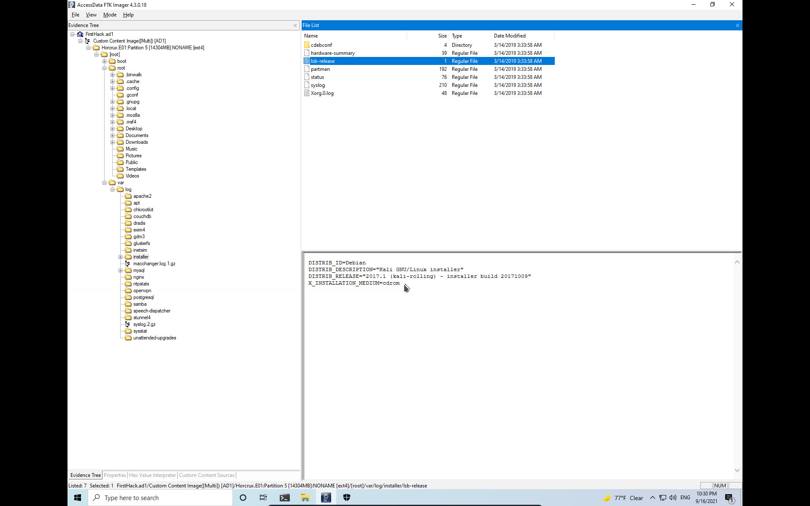
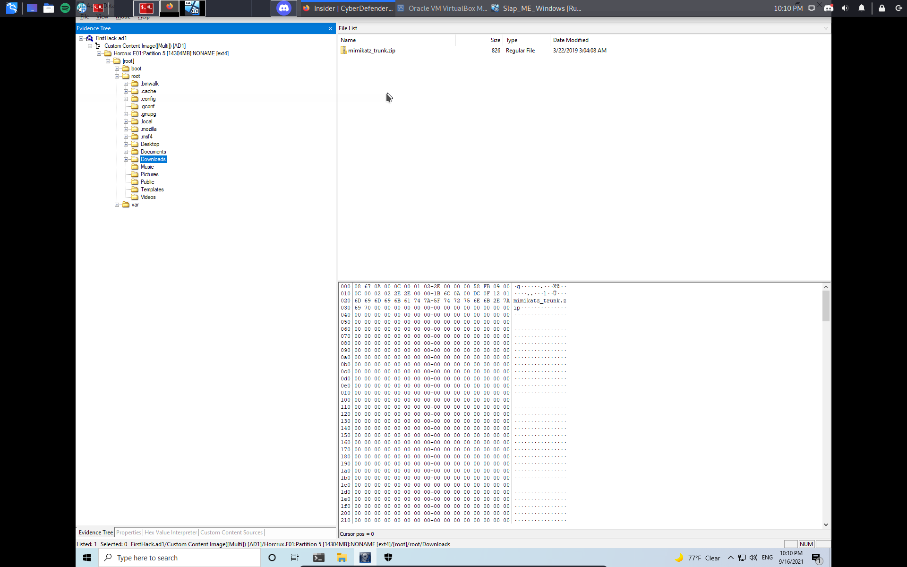
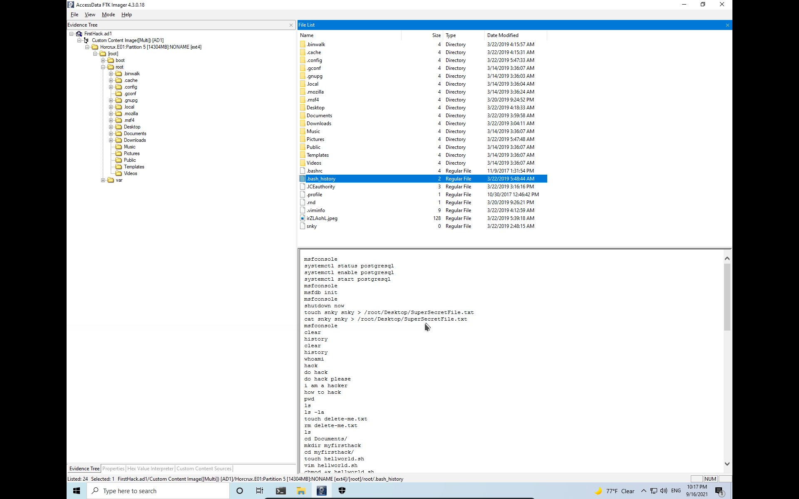
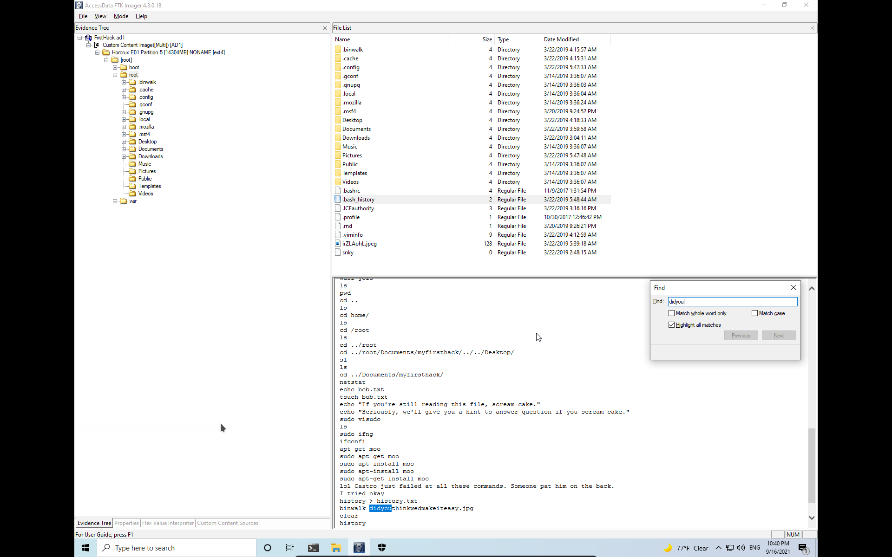
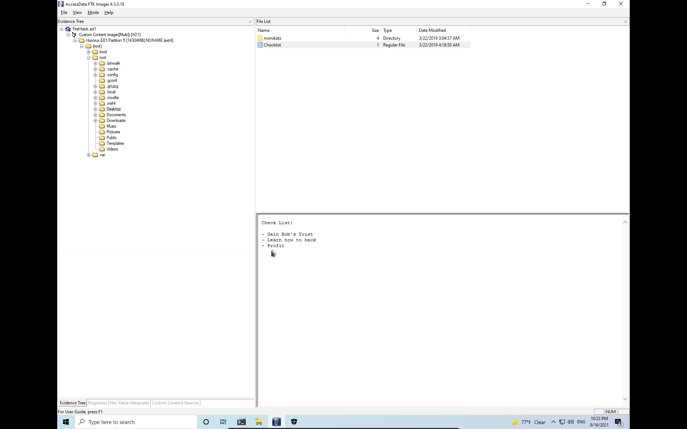
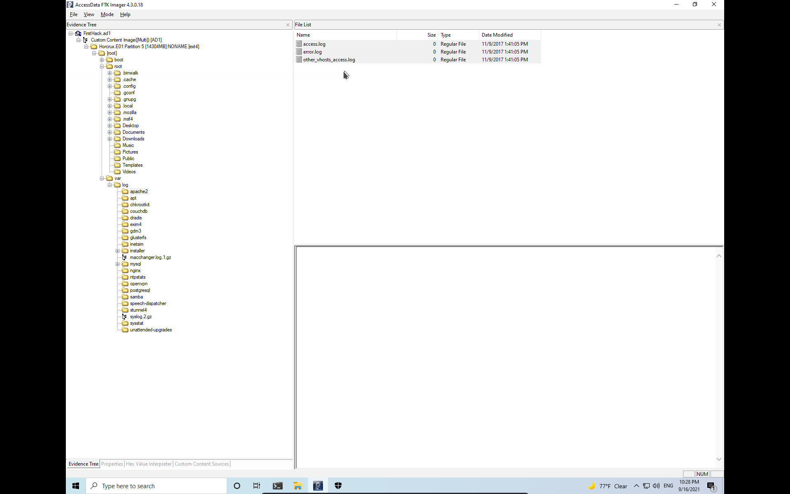
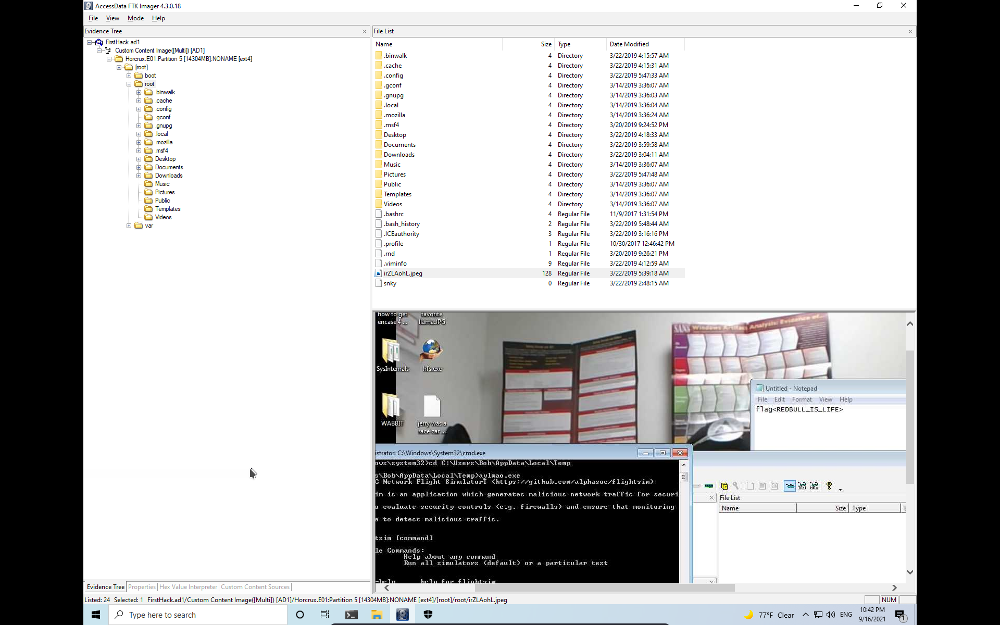
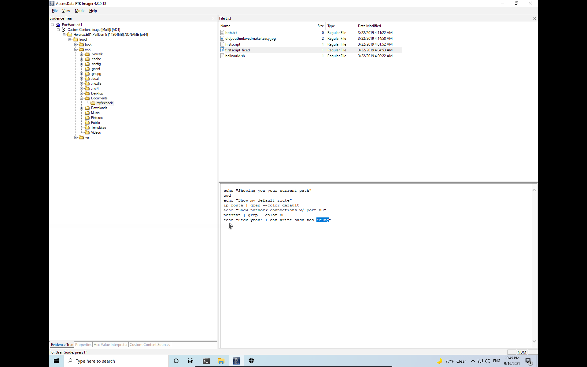
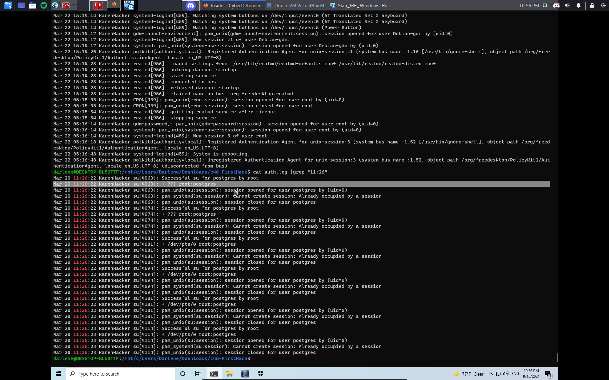
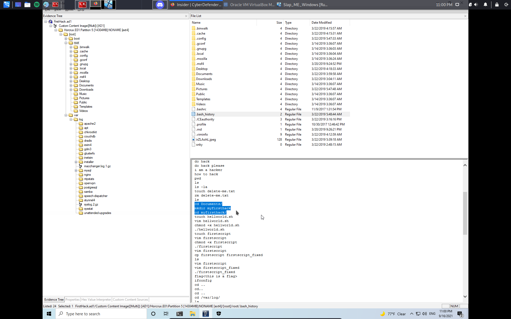

# Author:Panagiotis Fiskilis/Neuro

## challenge name:CyberDefenders:Insider ##

## Description: ##

```
After Karen started working for 'TAAUSAI,' she began to do some illegal activities inside the company. 'TAAUSAI' hired you to kick off an investigation on this case.

You acquired a disk image and found that Karen uses Linux OS on her machine. Analyze the disk image of Karen's computer and answer the provided questions.
```

### Tools: ###

- FlareVM

- FTK Imager(Windows Version)

### Flags: ###

- Flag 1:```kali```

Really common



- Flag 2:```d41d8cd98f00b204e9800998ecf8427e```

We export the <code>/var/log/apache2/access.log</code> and do an md5sum

- Flag 3:```mimikatz_trunk.zip```

We find mimikatz zip file on root's Download folder:



- Flag 4:```/root/Desktop/SuperSecretFile.txt```



- Flag 5:```binwalk```



- Flag 6:```profit```




- Flag 7:```0```

All the <code>apache2</code> logs are empty



- Flag 8:```irZLAohl.jpeg```



- Flag 9:```Young```



- Flag 10:```postgres```



- Flag 11:```/root/Documents/myfirsthack/```


