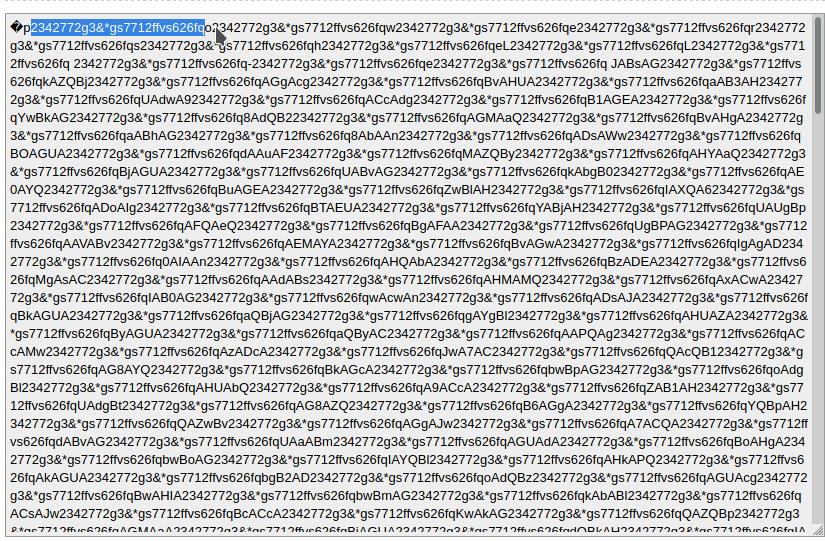

# Author:Panagiotis Fiskilis/Neuro

# Challenge name:Cyber Defenders:MalDoc101

## Description: ##

```
It is common for threat actors to utilize living off the land (LOTL) techniques, such as the execution of PowerShell to further their attacks and transition from macro code. This challenge is intended to show how you can often times perform quick analysis to extract important IOCs. The focus of this exercise is on static techniques for analysis.
```

*Tools:*

- oledump

- oledumpvba

- vipermonkey

- anyrun

- hybrid analysis

- virus total

Flags:

- Flag 1:```16```

```bash
oledump sample.bin |cut -d " " -f 2-3 |grep -i "m" |tail -1
```

The streams with the m or M have macros


- Flag 2:```Document_open```


- Flag 3:```emotet```

We will use <code>virus total</code> to findinformation about the maldoc

file md5sum:<code>d50d98dcc8b7043cb5c38c3de36a2ad62b293704e3cf23b0cd7450174df53fee</code>

Virus total link:

```
https://www.virustotal.com/gui/file/d50d98dcc8b7043cb5c38c3de36a2ad62b293704e3cf23b0cd7450174df53fee/details
```

- Flag 4:```34```

We start by using:

```bash
olevba sample.bin
```

From the olevba output we find the base64 encoded and also find the nameof the stream that it came from:

Stream name:<code>Macros/roubhaol/i09/o</code>


Then we grep for the stream name on the oledump output:

```bash
oledump MalDoc101/sample.bin |grep "Macros/roubhaol/i09/o"
```


- Flag 5:roubhaol

That's the base form that everytrhing inside the Maldoc takes place:


- Flag 6:```2342772g3&*gs7712ffvs626fq```

We use <code>olevba</code> to find the base64 payload

Then I copied the base64 and used an online tool to decode it (I could see it better on the online tool)

The decoded output looks like this:


As we can see there is some kind of pattern of 'random' bytes

So I checked on the base64 header and through observation I found the pattern and the flag:



- Flag 7:```powershell```

Common for Maldoc attack especially emotet like maldocs

<sub>Also found it on anyrun</sub>

- Flag 8:```Win32_Process```

Very common for Maldoc attack especially emotet like maldocs

```
https://docs.microsoft.com/en-us/windows/win32/cimwin32prov/create-method-in-class-win32-process
```

Also we are in windows so the best way to invoke anything is via the Win32 API

- Flag 9:```haoqunkong.com```

Used anyrun/virus total to get as much info as possible for the malware action:


