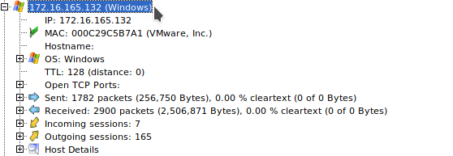
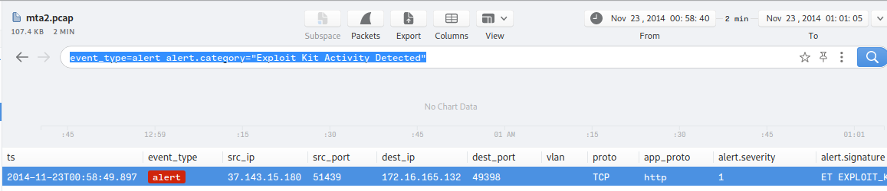

# Author:Panagiotis Fiskils/Neuro

# Challenge name:Cyber Defenders:Malware Traffic Analysis 2

Solution:


Flags:

- Flag  1:```172.16.165.132```

We open the pcap with <code>network miner</code> and find out that the only Windows personal computer on the network (which is also the infected Windows VM) has the flag as ipv4



- Flag  2:```00:0c:29:c5:b7:a1```

We know the ip of the machine so netminer shows as extra info including the MAC address


- Flag  3:```37.143.15.180:51439```

We open the pcap on both <code>Brim Security and Wireshark</code>

We search for <code>Suricata alerts</code> on Brim and get the following filter:

```
event_type=alert alert.category="Exploit Kit Activity Detected"
```


- Flag  4:```g.trinketking.com,h.trinketking.com```

We know the ipv4 of the attack box, with the help of <code>Network Miner</code> we can find the dns name that the attacker ip resolved:


- Flag  5:```192.30.138.146```

We use <code>Wireshark</code> anduse the following filter:

```
http && ip.dst==172.16.165.132
```

After that we follow the HTTP Streams with the websites 

We find that in tcpstream 1 the flag ip is the compromised website

- Flag  6:```hijinksensue.com```

We know the ipv4 of the website, with the help of Network Miner we can find the domain:


- Flag  7:```Sweet Orange```

We start with Brim security and the "Exploit Kit" filter:

```
event_type=alert alert.category="Exploit Kit Activity Detected"
```



We export the results in the <code>flag7.zng</code> file and use the information from the zng report for the ips and ports involved in the exploitation

So we get the following filter:

```
http && ip.src==37.143.15.180 && ip.dst==172.16.165.132 && tcp.srcport==51439 && tcp.dstport==49398
```

Inside the data field of TCP we see the header of an exe file


We export the <code>exploit_kit.exe</code> file and send it to virus total

After some search for old reports we find the flag

- Flag  8:```static.charlotteretirementcommunities.com/k?tstmp=3701802802```

We used the following site to automatically analyze the pcap:

```
https://packettotal.com/
```


- Flag  9:```50.87.149.90```

```bash
tshark -r mta2.pcap -Y "dns && ip.dst==172.16.165.132" |grep "static.charlotteretirementcommunities.com"
```

- Flag  10:```1408275c2e2c8fe5e83227ba371ac6b3```

```bash
md5sum exploit_kit.exe
```

- Flag  11:```CVE-2014-6332```

Search for <code>Sweet Orange CVE</code>

Found this:

```
https://malware.dontneedcoffee.com/2014/11/cve-2014-6332.html
```

- Flag  12:```application/x-dosexec```

I used <code>Brim Security</code>

I searched forthe mime_type and the timestamp

- Flag  13:```http://hijinksensue.com/assets/verts/hiveworks/ad1.html```

We used <code>Brim Security</code> with filter:

```
files  and filename != null and filename = f.txt
```

- Flag  14:```23/11/2014```

used Brim:


- Flag  15:```21/11/2014```

```
exiftool exploit_kit.exe |grep "Date"
```

- Flag  16:Cybertrust

```bash
tshark -r mta2.pcap -Y "tls.handshake.certificate"
```

- Flag  17:```Dep,Seh```

Common knowledge

