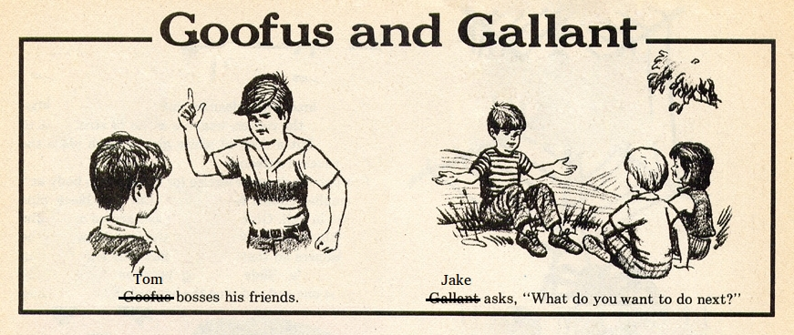
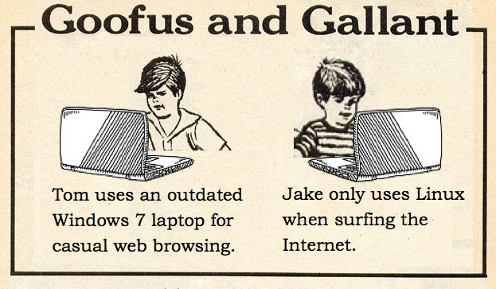
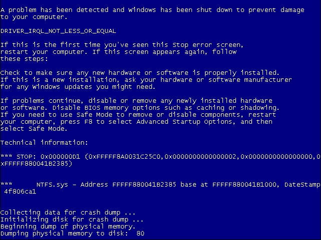
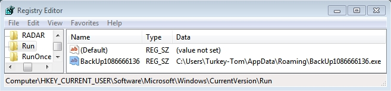
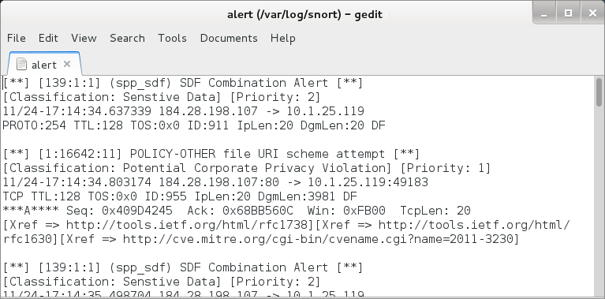
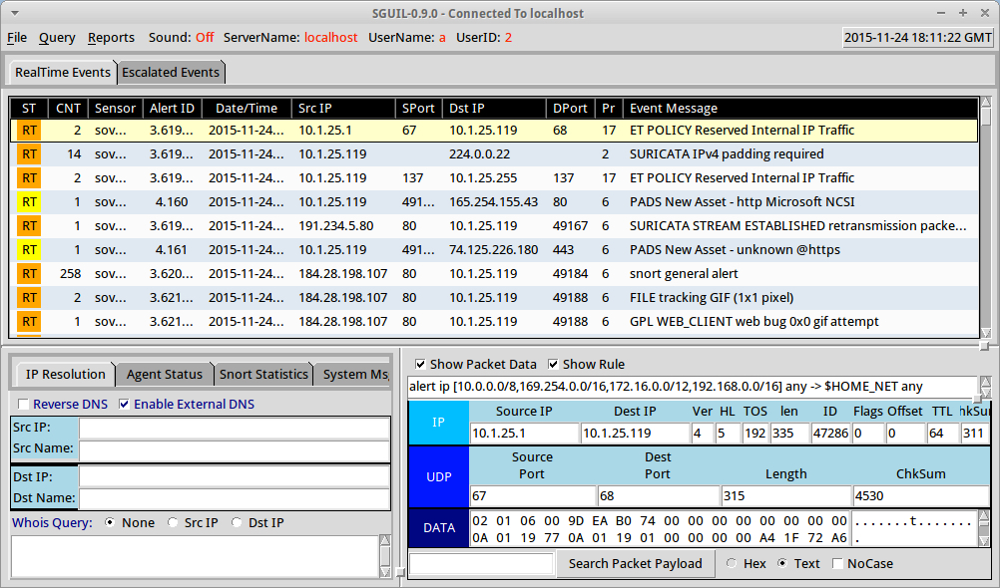
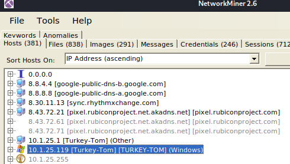
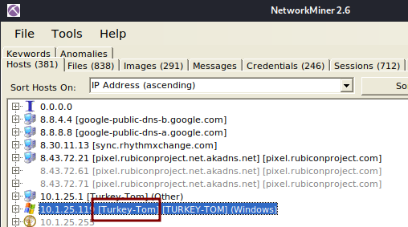
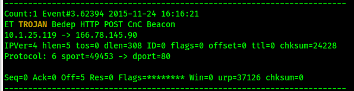

# Author:Panagiotis Fiskils/Neuro

## Challenge name:Cyber Defenders:Malware Traffic Analysis 4

### Description: ###

```
Tom and Jake are recent hires at your organization's Security Operations Center (SOC).  Due to their different personalities, they've earned the nickname "Goofus and Gallant" after a cartoon from the magazine Highlights for Children.  Tom is Goofus.  Jake is Gallant.
```



```
On the Tuesday before Thanksgiving, Tom and Jake are working at the SOC.  Tom brought his Windows laptop to the office, and he plans to browse the web.  Jake is hard at work reviewing alerts.
```



```
Jake's holiday plans are set, and he's happy with the frozen turkey he'd purchased from the supermarket.  Tom's more of a "turkey enthusiast."  He wants to hunt and kill a turkey for his Thanksgiving meal.

To pursue his holiday plans, Tom decides to purchase a shotgun.  He fires up his Windows laptop, connects to the SOC's wifi, and starts researching shotguns online.

It's not long before Tom's computer triggers some alerts for suspicious network activity.  After those alerts, his laptop crashes!
```



```
You're the supervisor for both Goofus and Gallant. The Goofus Tom will likely be fired at some point due to his poor work ethic.  Jake is certainly gallant, but he's still a relatively inexperienced analyst. You'll have to figure out what happened to Tom's laptop.

You check Tom's machine and quickly find a suspicious registry entry.  It looks like Goofus infected his laptop.  The SHA256 hash for the file referenced in the registry is: d16ad130daed5d4f3a7368ce73b87a8f84404873cbfc90cc77e967a83c947cd2
```



```
Next, you review the network alerts.  Unfortunately, your organization is too cheap for any commercial intrusion detection system (IDS).  Fortunately, lower-cost solutions have been implemented.  You have access to Snort alerts using the Snort registered ruleset.  You also have access to Suricata alerts using the EmergingThreats free ruleset.
```





# Flags: #


- Flag1: `10.1.25.119`

From the Description we know that we have a Windows victim.

We open the given pcap file using <code>Network Miner</code>



- Flag2: `Turkey-Tom`

From the previous flag we know the IP of the victim machine, with <code>Network Miner</code> we can find the Hostname:



- Flag3:`Angler`

At first I tried using the pcap file and then I got bored and started scripting:

```bash
cat malware-traffic-analysis-4-suricata-events.txt |grep -B 4 -A 6 "10.1.25.119" |grep -i -A 5 -B 6 "cnc\|Trojan\|suricata" |less
```

After searching for the coresponding TROJAN: `Trojan.Bedep` I found that the exploit kit is `Angler`

```
https://blog.malwarebytes.com/detections/trojan-bedep/
https://www.trustwave.com/en-us/resources/blogs/spiderlabs-blog/bedep-trojan-malware-spread-by-the-angler-exploit-kit-gets-political/
```



- Flag4:

- Flag5:`x-flash-version`

From common knowledge and some googling.

- Flag6:

Found this article about `Angler`:

```
https://www.forcepoint.com/blog/x-labs/popular-site-leads-angler-ek-cve-2015-8651-flash-player-exploit
```

We have to find all the systems that sent the host a swf file.

- Flag7:

- Flag8:

- Flag9:

- Flag10:

