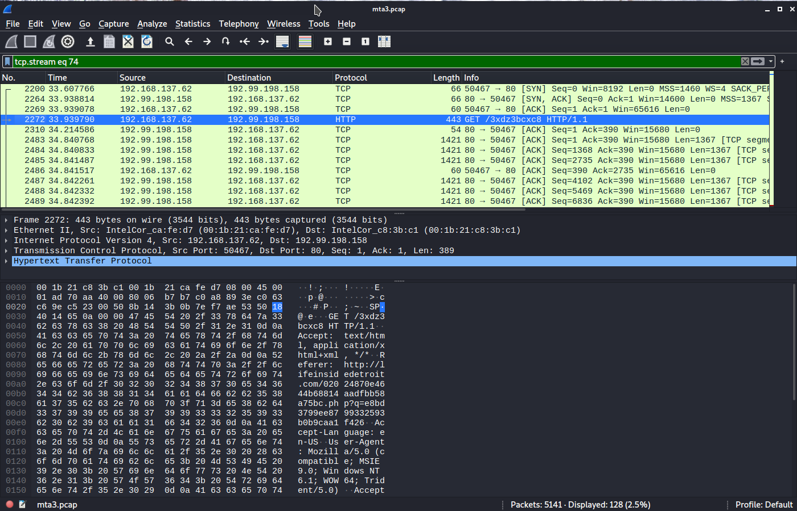
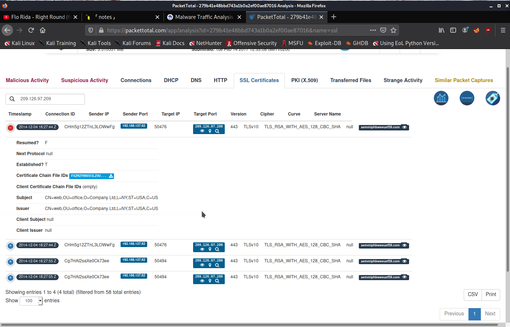

# Author:Panagiotis Fiskilis/Neuro

## Challenge name:CyberDefenders:Malware Traffic Analysis 3 ##

### Description: ###

```
The attached PCAP belongs to an Exploitation Kit infection. Analyze it using your favorite tool and answer the challenge questions.
```

### Tools: ###

- Wireshark

- Tshark

- Network Miner

- Brim Security

- Bash oneliners

## Flags: ##

- Flag 1:```192.168.137.62```

We open the pcap file on <code>Brim Security</code> and search for suricata alerts,because the question talks about an infected machine and possibly surricata will detect the infection as <code>network Trojan</code> sent fromt he attacker: <code>192.99.198.158</code>


- Flag 2:```Angler EK```

We use packetTotal to analyze the pcap file.

In one of the NetworkTrojan detections we canfind the name of the exploit kit and get the flag


- Flag 3:```qwe.mvdunalterableairreport.net```

We know the attacker ip:<code>192.99.198.158</code>, that's the ip that delivered the exploit so we findthe dns names and grep for the ip

```Bash
tshark -r mta3.pcap -Y "dns" |grep "192.99.198.158"
```


- Flag 4:``` http://lifeinsidedetroit.com/02024870e4644b68814aadfbb58a75bc.php?q=e8bd3799ee8799332593b0b9caa1f426```

We used <code>Packet total</code> to analyze the pcap file and found a Malware(Was detected as network Troyan) that came from the flag url

```
https://packettotal.com/app/analysis?id=279b41e48bbd743a1b0a2ef00ae87016
```


- Flag 5:```earsurgery.org```

We use wireshark and go on statistics --> HTTP requests, use the ip as filter and sort the data


- Flag 6:```80```

We have the malicious domain: <code>qwe.mvdunalterableairreport.net</code>


We find a very suspicious base64 and we check the tcp stream(74)



After that we find when it is delivered (stream 80)


- Flag 7:```209.126.97.209```

We use packet total to analyze the pcap and find a SSL layer with a NetworkTrojan


- Flag 8:```24/11/2024```

We use packet total to analyze the pcap and find the certifcate from the last question



We download the certifcatertificate and execute file to find the expiration date

```Bash
file extract-1417717664.807302-SSL-FXzMZYrRXV3lZVu1g.raw
```


- Flag 10:```icVsx1qBrNNdnNjRI.dll```

```bash
binwalk -e mta3.pcap
cd _mta3.pcap.extracted/
file icVsx1qBrNNdnNjRI.dll
```

- Flag 11:```3dfa337e5b3bdb9c2775503bd7539b1c```

We extract the hhtp objects and try to find any files that are obfuscated or encrypted:

```Bash
file * |grep "data$"
```

We found <code>680VBFhpBNBJOYXebSxgwLrtbh3g6JFUllqksWFSsGshhwsguyNL26MGul2oZ3b8</code>

with some sime xxd/hexdump we can find a pattern: <code>adR2b4nh</code>

Then we triedxorring the pattern and found a PE/dll file with some shellcode on top of it weused:

```bash
binwalk -e sample.exe
```

And got the real dll that started the infection

- Flag 12:```SEH,Canary```

Common for malwares

- Flag 13:```09/01/2002```

From virus total analysis

- Flag 14:```http://adstairs.ro/544b29bcd035b2dfd055f5deda91d648.swf```

We know that the flash player file came from http so we try to find the flash file inside the http objects:

```Bash
file * |grep "swf"
# found 544b29bcd035b2dfd055f5deda91d648.swf
```

Now we have to find the source and destination ip:

```bash
tshark -r ../mta3.pcap -Y "http" |grep "544b29bcd035b2dfd055f5deda91d648.swf"
```

Finally we get the flag:

```Bash
tshark -r ../mta3.pcap -Y "http" -T fields -e http.referer |grep "544b29bcd035b2dfd055f5deda91d648.swf"
```

- Flag 15:```CVE-2013-2551```

I searched for:

```
Angler EK adR2b4nh cve
```

And found this:

```
https://malware.dontneedcoffee.com/2014/08/angler-ek-now-capable-of-fileless.html
```

- Flag 16:```9```


- Flag 17:```ssl.gstatic.com```

Time diff from wireshark and luck

- Flag 18:```Google```

Used both netminer and brim but Finally

I exported all the search and found the one with the greatest index andit was google

