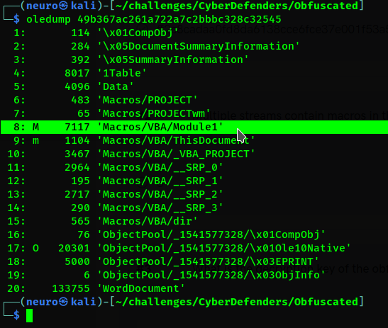
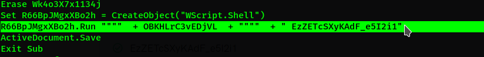
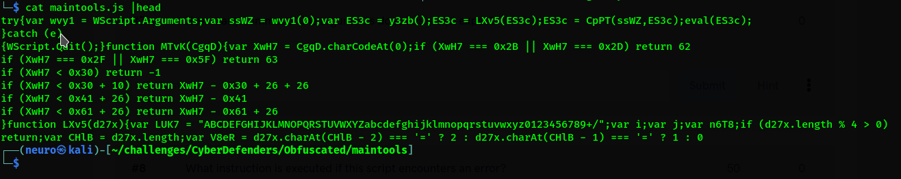
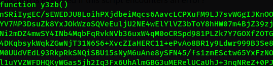
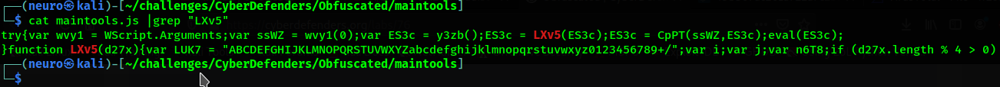

# Author:Panagiots Fiskilis/Neuro

## Challenge name:CyberDefenders:Obfuscated ##

### Flags: ###

- Flag 1:```ff2c8cadaa0fd8da6138cce6fce37e001f53a5d9ceccd67945b15ae273f4d751```

```bash
sha256sum 49b367ac261a722a7c2bbbc328c32545
```

- Flag 2:

```bash
oledump 49b367ac261a722a7c2bbbc328c32545
```



- Flag 3:```EzZETcSXyKAdF_e5I2i1```

```bash
/opt/ViperMonkey/docker/dockermonkey.sh 49b367ac261a722a7c2bbbc328c32545 |tee Vmonkey.log
```

Possible key creation or usage:



- Flag 4:```C:\Users\IEUser\AppData\Roaming\Microsoft\Windows\maintools.js```

We used anyrun to analyze any malicious activity, analyzed the processes and search for dropped files

- Flag 5:```JScript```

Common for Windows attacks and maldocs

- Flag 6:```wvy1```

```bash
cat maintools.js |head
```


- Flag 7:```1```


- Flag 8:```WScript.Quit()```

When something goes wrong we exit


- Flag 9:```y3zb```

Simple code auditing



- Flag 10:```LUK7```

```bash
cat maintools.js |grep "LXv5"
```



- Flag 11:```Bas64```

Common

- Flag 12:```Key-scheduling algorithm```

In later flags we find that the algorithm is RC4 the first part of the algorithm is the Key-scheduling algorithm KSA

**For resources:** Read RC4 documentation and/or this:

```
https://en.wikipedia.org/wiki/RC4
```

- Flag 13:```command-line arguments```

Simple code auditing

- Flag 14:```key```

Possible key creation or usage

- Flag 15:```RC4```

Very Vey common encryption algorithm for scripts and uses a single key also RC4's logic can be found by the 2 loops on the JScript code

- Flag 16:```eval```

Most malwares either eval or use reflection to execute

- Flag 17:```CSCRIPT.EXE```

Found this article:

```
https://www.itprotoday.com/devops-and-software-development/how-do-i-run-windows-script-command-line
```

- Flag 18:```UspD```

A friend helped with the double encoding and encryption

We also infected a VM and tracked the processes
