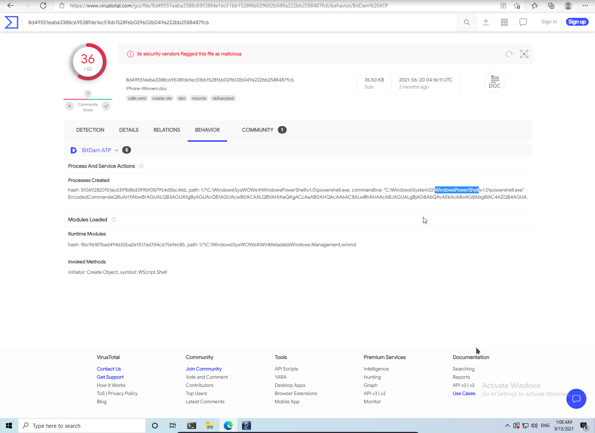

# Author: Panagiotis Fiskilis/Neuro

## Description: ##

```
A company’s employee joined a fake iPhone giveaway. Our team took a disk image of the employee's system for further analysis. As a security analyst, you are tasked to identify how the system was compromised.
```

##Basic Housekeeping:##


#Flags:

- Flag 1:```WIN-NF3JQEU4G0T```

Downloaded <code>AccessData Registry Viwer</code>

And opened the System registry


- Flag 2:```Whatsapp```


- Flag 3:```http://appIe.com/IPhone-Winners.doc```

We know the malicious domain from question 6

- Flag 4:```10```

- Flag 5:```powershell```

We used Virus total and anyrun to simulate the effects of the macro



- Flag6:```http://appIe.com/Iphone.exe```


- Flag 7:```C:\Temp\IPhone.exe```


- Flag 8:```Metasploit```

Infected a malware analysis VM and used <code>Windows Defender and Malwarebytes</code> to identify the payload

- Flag 9:```155.94.69.27```

Got the file hash and used <code>virus total</code>


- Flag 10:```http://appIe.competitions.com/login.php```

Found the <code>places.sqlite</code> file and analyzed it with a sqlite DB viwer

- Flag 11:```GacsriicUZMY4xiAF4yl```

Found the <code>cookies.sqlite</code> file at:

<code>C:\<username here>\APPdata\Roaming\Mozilla\firefox\profiles\ </code>

and used a SQLite DB viwer to analyze the cookies and get the password
