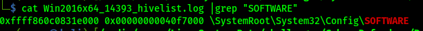

<h1>Author: Panagiotis Fiskilis/Neuro</h1>

<h2>Challenge name: CyberDefenders: Pwned-DC</h2>

<h3>Description:</h3>

```
An ActiveDirectory compromise case: adversaries were able to take over corporate domain controller. Investigate the case and reveal the Who, When, What, Where, Why, and How.
```

<h3>Flags:</h3>

- Flag 1:

Q: <code>What is the OS Product name of PC01?</code>

```bash
volatility -f memory.dmp imageinfo |tee imageinfo.log
AutoVol.sh -f memory.dmp
```

- Flag 2:

Q: <code>On 21st November, there was unplanned power off for PC01 machine. How long was PC01 powered on till this shutdown?</code>

- Flag 3:

Q: <code>Who was the last logged-in user on PC01?</code>

- Flag 4:

Q: <code>What is the IP address of PC01?</code>

- Flag 5:

Q: <code>Which port was assigned to man service on PC01?</code>

- Flag 6:

Q: <code>What is the "Business.xlsx" LogFile Sequence Number?</code>

- Flag 7:

Q: <code>What is the GUID of the C drive on PC01 machine?</code>

- Flag 8:

Q: <code>What link did the user visit on 2021-11-22 at 19:45:55 UTC?</code>

- Flag 9:

Q: <code>How many bytes were received by firefox?</code>

- Flag 10:

Q: <code>What is the folder name where note.txt resides?</code>

- Flag 11:```Win2016x64_14393```

Q: <code>Which volatility 2 profile should be used to analyze the memory image?</code>

I used imageinfo from volatility2:

```bash
volatility -f memory.dmp imageinfo |tee imageinfo.log
```

Tried to analyze the sample with some generic Windows 10 profiles.

- Flag 12:```0x00000000040f7000```

Q: <code>Analyzing the memory what is the physical address of the SOFTWARE registry hive?</code>

For some automated memory enumeration I used a custom tool:

```
https://github.com/Panagiotis-INS/AutoVolatility
```

```bash
AutoVol.sh -f memory.dmp --profile=Win2016x64_14393
cat Win2016x64_14393_hivelist.log |grep "SOFTWARE"
```



- Flag 13:

Q: <code>Using the provided word list, what is the password of the user "0xMohammed"?</code>

- Flag 14:

Q: <code>What is the name of the first malware detected by Windows Defender?</code>

- Flag 15:

Q: <code>Provide the date and time when the attacker clicked send (submitted) the malicious email?</code>

- Flag 16:

Q: <code>What is the IP address and port on which the attacker received the reverse shell? IP:PORT</code>

- Flag 17:

Q: <code>Analyzing the reverse shell. What is the first argument given to InternetErrorDlg API?</code>

- Flag 18:

Q: <code>What is the MITRE ID of the technique used by the attacker to achieve persistence?</code>

- Flag 19:

Q: <code>What is the attacker's C2 domain name?</code>

- Flag 20:

Q: <code>what is the name of the tool used by the attacker to collect AD information?</code>

- Flag 21:

Q: <code>What is the PID of the malicious process?</code>

- Flag 22:

Q: <code>What is the family of ransomware?</code>

- Flag 23:

Q: <code>What is the command invoked by the attacker to download the ransomware?</code>

- Flag 24:

Q: <code>Provide the number of ransomware process' privileges that are enabled by default?</code>

- Flag 25:

Q: <code>What is the pool tag of the ransomware process?</code>

- Flag 26:

Q: <code>What is the address where the ransomware stored the 567-byte key under the malicious process' memory?</code>

- Flag 27:

Q: <code>What is the 8-byte word hidden in the ransomware process's memory?</code>

- Flag 28:

Q: <code>What is the virtual address of the device where the ransomware file where opened?</code>

- Flag 29:

Q: <code>What is the physical address where the ransomware file is stored in memory?</code>

- Flag 30:

Q: <code>What is the ransomware file's internal name?</code>

- Flag 31:

Q: <code>Analyzing the ransomware file. what is the API used to get the geographical location?</code>

