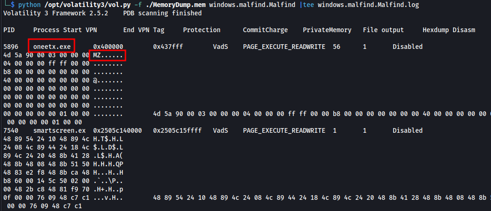
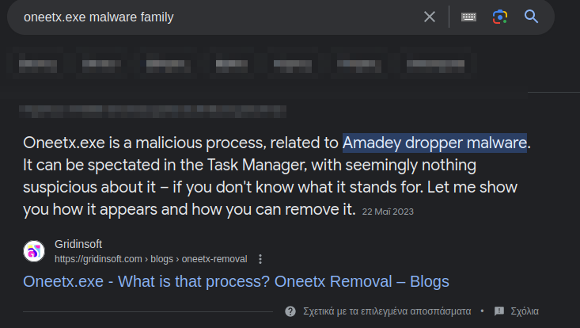

# Title:  RedLine Blue Team Challenge 

## Author: Panagiotis Fiskilis / Neuro


### Questions:

Flag1:`oneetx.exe`

Q1:What is the name of the suspicious process?

```bash
python /opt/volatility3/vol.py -f ./MemoryDump.mem windows.pslist.PsList |tee windows.pslist.PsList.log
cat windows.pslist.PsList.log |grep "msedge.exe" |cut -d "  " -f 1 >msedge.exe_PIDs
##5328\|4396\|1144\|4544\|5340\|2388\|6292\|7964\|6544\|8896\|5156
```


```bash
python /opt/volatility3/vol.py -f ./MemoryDump.mem windows.pstree.PsTree |tee windows.pstree.PsTree.log
python /opt/volatility3/vol.py -f ./MemoryDump.mem windows.malfind.Malfind |tee windows.malfind.Malfind.log
```



<br>


Flag2:`rundll32.exe`

Q2: What is the child process name of the suspicious process?

```bash
cat windows.pstree.PsTree.log|grep -A 3 "oneetx.exe"
```


Flag3:`PAGE_EXECUTE_READWRITE`

Q3: What is the memory protection applied to the suspicious process memory region?

Classic


Flag4:`Outline.exe`

Q4: What is the name of the process responsible for the VPN connection?

```bash
python /opt/volatility3/vol.py -f ./MemoryDump.mem windows.filescan.FileScan |tee windows.filescan.FileScan.log
cat windows.filescan.FileScan.log|grep "Users"|grep -i "Tammam" |grep -i "vpn"
cat windows.pstree.PsTree.log|grep -i -A 3 -B 3 "tun"
```


Flag5:``

Q5: What is the attacker's IP address?

```bash
python /opt/volatility3/vol.py -f ./MemoryDump.mem windows.netstat.NetStat |tee windows.netstat.NetStat.log
cat windows.pstree.PsTree.log|grep -i "5896"
```


We must use the Volatility2 tool now

```bash
python /opt/volatility/vol.py -f ./MemoryDump.mem --profile=Win10x64_19041 memdump -p 5896 -D ./dumps
```


```bash
strings dumps/5896.dmp |grep "http" |grep -v -i "micro"
```


<br>


Flag6:`RedLine Stealer`

Q6: Based on the previous artifacts. What is the name of the malware family?



```
https://gridinsoft.com/dropper/amadey
```


Flag7:`http://77.91.124.20/store/games/index.php`

Q7: What is the full URL of the PHP file that the attacker visited?

Check screenshot from flag 6


Flag8:`C:\Users\Tammam\AppData\Local\Temp\c3912af058\oneetx.exe`

Q8 :What is the full path of the malicious executable?


