# Author:Panagiotis Fiskils/Neuro

## Challenge name:Cyber Defenders: Seized

### Description: ###

```
Using Volatility, utilize your memory analysis skills to Investigate the provided Linux memory snapshots and figure out attack details.
```

<i>NOTE: The challenge provides the Linux Kernel profile to add to Volatility</i>

We just have to copy the "Centos7.3.10.1062.zip" to:

```
/opt/Volatility/Volatility/plugins/overlays/linux
```

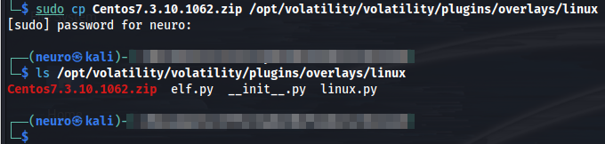

We check if the profile is added to Volatility:

```bash
volatility --info |grep -i "Linux" |grep -i "profile"
```

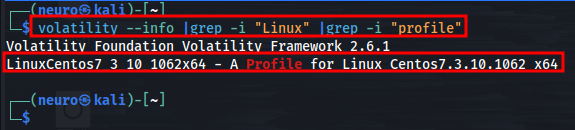

<h3>Flags:</h3>

- Flag 1: ` 7.7.1908` 

Q: <code> What is the CentOS version installed on the machine? </code>

We will use <code>Strings</code> on the memory file and search for "CentOS Linux":

```bash
strings dump.mem |grep "CentOS Linux"
```

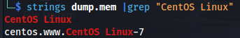

After enumerating the output of the <code>strings</code> command we can find the version:

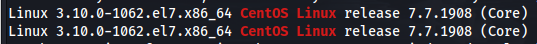

- Flag 2: `shkCTF{l3ts_st4rt_th3_1nv3st_75cc55476f3dfe1629ac60}`

Q: <code> There is a command containing a strange message in the bash history. Will you be able to read it? </code>

```bash
volatility -f dump.mem --profile=LinuxCentos7_3_10_1062x64 linux_bash |tee linux_bash.log
```

We find the following commands:

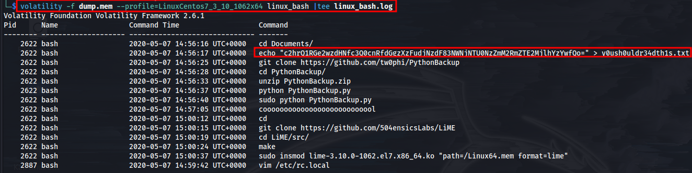

We can also find the following base64 encoded text:

```
c2hrQ1RGe2wzdHNfc3Q0cnRfdGgzXzFudjNzdF83NWNjNTU0NzZmM2RmZTE2MjlhYzYwfQo=
```

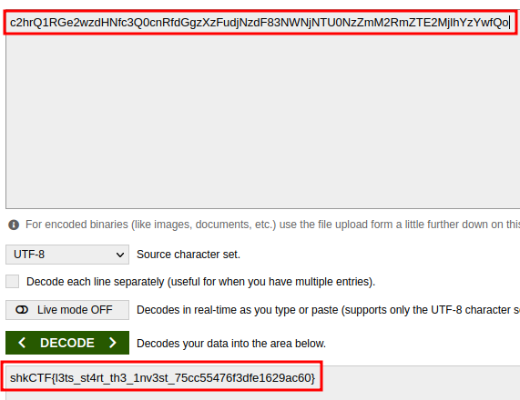

- Flag 3: `2854`

Q: <code> What is the PID of the suspicious process? </code>

```bash
volatility -f dump.mem --profile=LinuxCentos7_3_10_1062x64 linux_psaux |tee linux_psaux.log
```

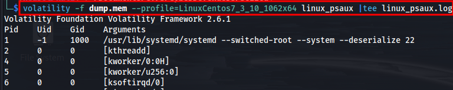

We found a `nc` bind shell:

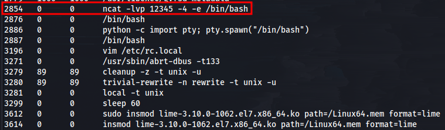

- Flag 4: `shkCTF{th4t_w4s_4_dumb_b4ckd00r_86033c19e3f39315c00dca}`

Q: <code> The attacker downloaded a backdoor to gain persistence. What is the hidden message in this backdoor? </code>

```bash
volatility -f dump.mem --profile=LinuxCentos7_3_10_1062x64 linux_enumerate_files |tee linux_enumerate_files.log
```

Using the evidence files from the 'bash' and 'process' quiestions, we find a GitHub repo that looks suspicious:

```
https://github.com/tw0phi/PythonBackup
```

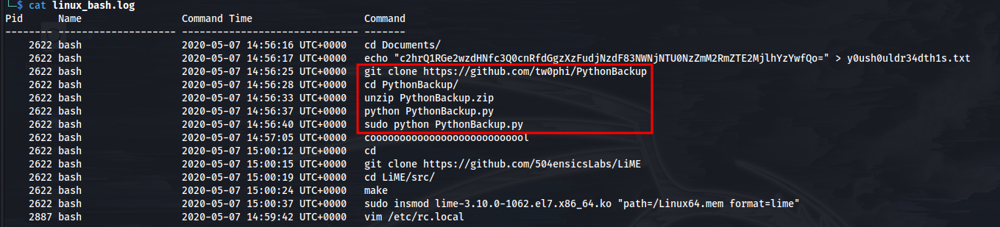

Inside an isolated VM we clone the source code of the backdoor and start some manual auditing:

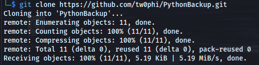

We will use the <code>bat</code> which can be downloaded from GitHub:

```
https://github.com/sharkdp/bat
```

After some file enumeration we find a 'secret' command on `app/snapshot.py`:

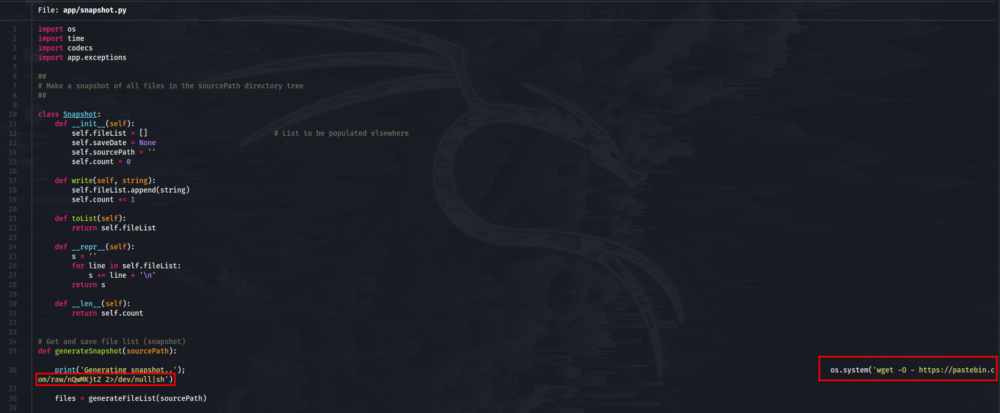

We follow the link:

```
https://pastebin.com/raw/nQwMKjtZ
```

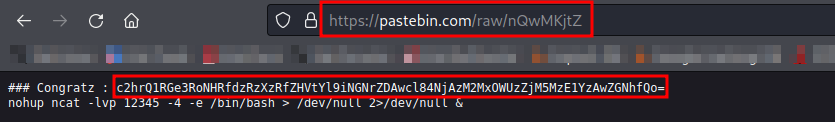

We find the following base64 text:

```
c2hrQ1RGe2wzdHNfc3Q0cnRfdGgzXzFudjNzdF83NWNjNTU0NzZmM2RmZTE2MjlhYzYwfQo
```

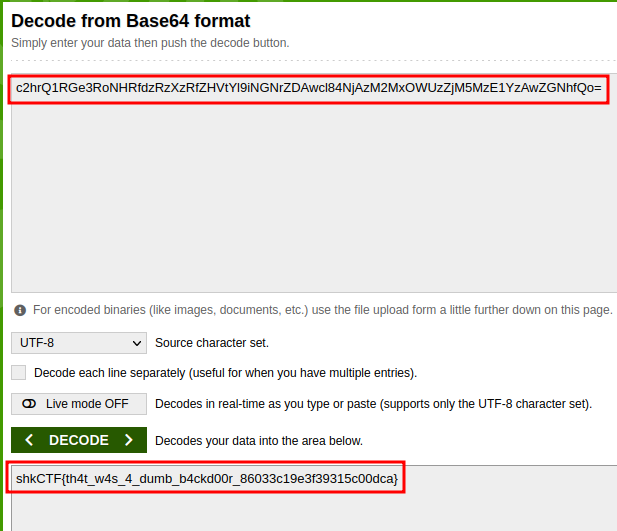

- Flag 5: `192.168.49.1:12345`

Q: <code> What are the attacker's IP address and the local port on the targeted machine? </code>

```bash
volatility -f dump.mem --profile=LinuxCentos7_3_10_1062x64 linux_netstat |tee linux_netstat.log
volatility -f dump.mem --profile=LinuxCentos7_3_10_1062x64 linux_ifconfig |tee linux_ifconfig
```

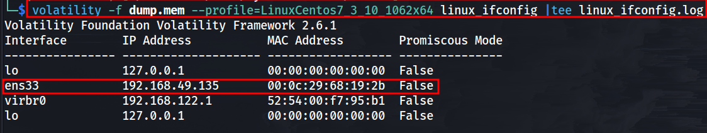

Using the commands from the 'bash history' quiestion we can make a good guess that the attacker has performed the actions shown on the screenshot:

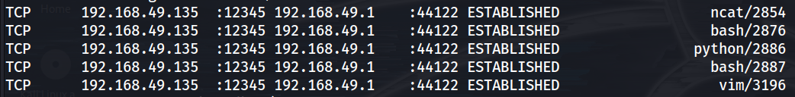

So the attacker's IP is: `192.168.49.1` and connected to the local/machine port: `12345`

- Flag 6: `python -c import pty; pty.spawn("/bin/bash")`

Q: <code> What is the first command that the attacker executed? </code>

Very common command, when we pop a shell.

- Flag 7: `shkCTF{rc.l0c4l_1s_funny_be2472cfaeed467ec9cab5b5a38e5fa0}`

Q: <code> After changing the user password, we found that the attacker still has access. Can you find out how? </code>

We check the process history and find that the attacker used vim to edit the `/etc/rc.local` file.

We will use the unintended way:

```bash
strings dump.mem |grep -A 5 -B 5 "rc.local"
```

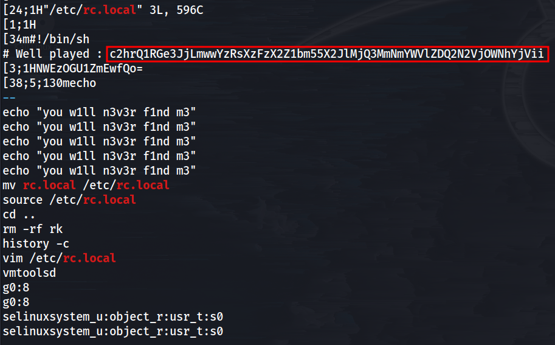

We get the following base64 text:

```
c2hrQ1RGe3JjLmwwYzRsXzFzX2Z1bm55X2JlMjQ3MmNmYWVlZDQ2N2VjOWNhYjVii
```

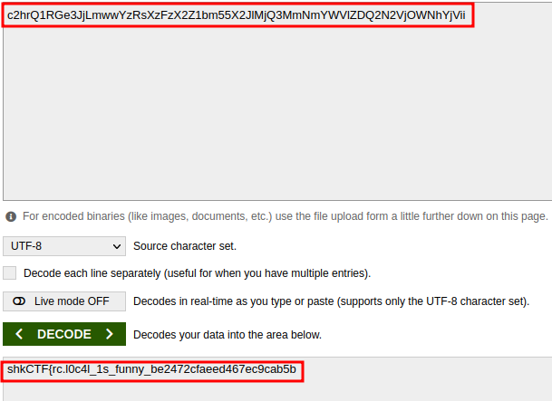

```
shkCTF{rc.l0c4l_1s_funny_be2472cfaeed467ec9cab5b5a38e5fa0}
```

- Flag 8: `sysemptyrect`

Q: <code> What is the name of the rootkit that the attacker used? </code>

A common pattern for malwares are to use Kernel modules, we will abuse this pattern to find the malware:

```bash
volatility -f dump.mem --profile=LinuxCentos7_3_10_1062x64 linux_lsmod |tee linux_lsmod.log
```

At the second line we find a module which looks suspicious:

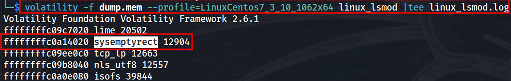

- Flag 9: `1337tibbartibbar`

Q: <code> The rootkit uses crc65 encryption. What is the key? </code>

Once again unintended solution for the win:

```bash
strings dump.mem |grep "crc65"
```

Intended solution:

We will dump the malicious kernel module:

```bash
volatility -f dump.mem --profile=LinuxCentos7_3_10_1062x64 linux_moddump -r sysemptyrect -D dump
```

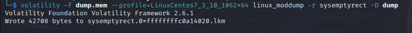

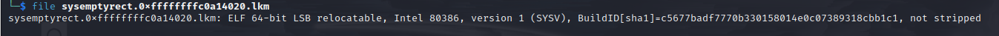

After dumping the module we will use <code>binary ninja</code> to find the key inside the module.


```
https://cyberdefenders.org/blueteam-ctf-challenges/progress/Neuro/92/
```
