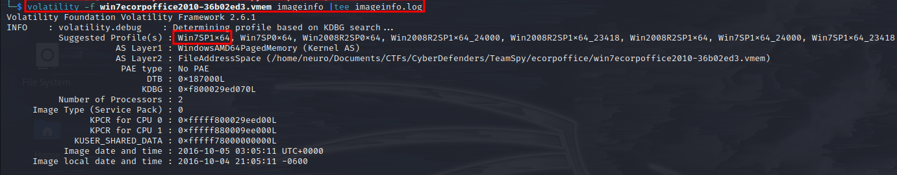
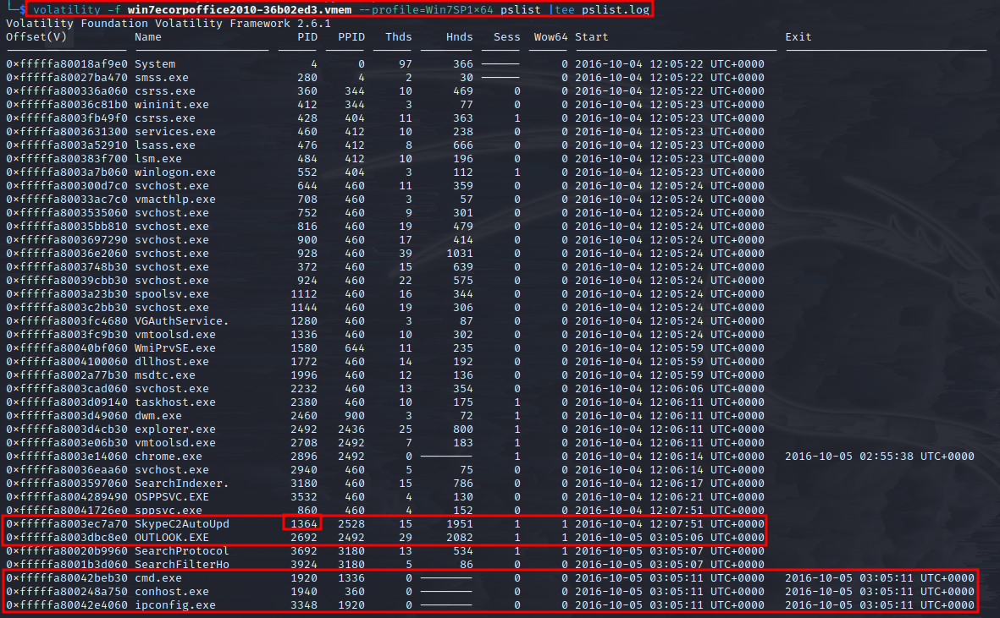
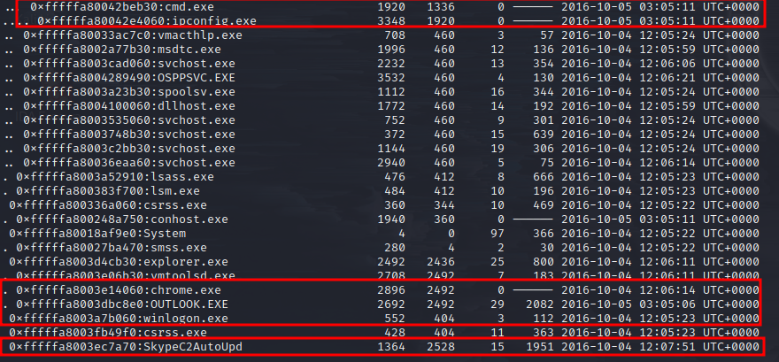
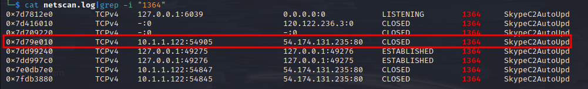
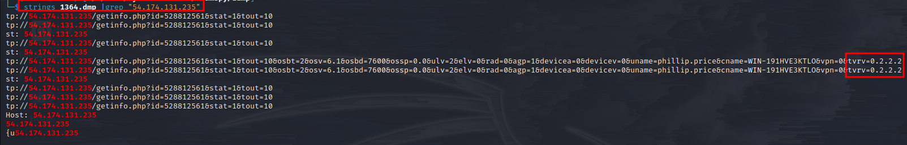
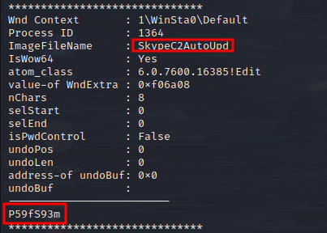
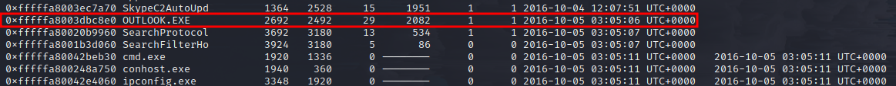
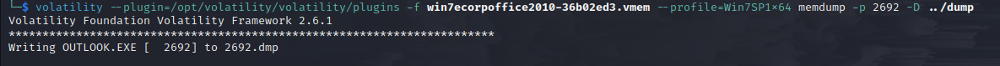
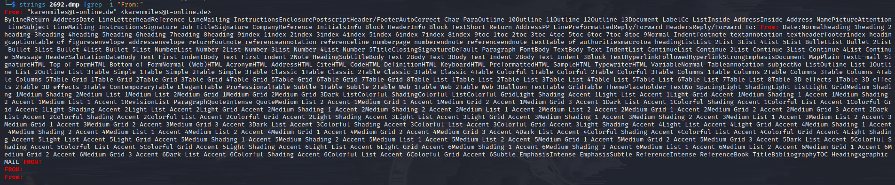

# Author:Panagiotis Fiskils/Neuro

## Challenge name:Cyber Defenders: Team Spy ##

### Description: ###

```
An employee reported that his machine started to act strangely after receiving a suspicious email with a document file. The incident response team captured a couple of memory dumps from the suspected machines for further inspection. Analyze the dumps and help the IR team figure out what happened!
```

The challenge gave us 2 file:

- ecorpoffice
- ecorpwin7

<h3>Flags:</h3>

- Flag 1: `1364`

File->ecorpoffice

Q: What is the PID the malicious file is running under?

```bash
volatility -f win7ecorpoffice2010-36b02ed3.vmem imageinfo |tee imageinfo.log
```



```bash
volatility -f win7ecorpoffice2010-36b02ed3.vmem --profile=Win7SP1x64 pslist |tee pslist.log
volatility -f win7ecorpoffice2010-36b02ed3.vmem --profile=Win7SP1x64 pstree |tee pstree.log
```

Found the `C2 over Skype process`





- Flag 2: `54.174.131.235`

Q: What is the C2 server IP address?

We will search for the connctions that the maliciousWe will search for the connections that the malicious process does:

```bash
volatility -f win7ecorpoffice2010-36b02ed3.vmem --profile=Win7SP1x64 netscan |tee netscan.log
cat netscan.log |grep -i "1364"
```



- Flag 3: `0.2.2.2`

Q: What is the Teamviewer version abused by the malicious file?

We will try to gather information about this exe by dumping the exe itself and its memory:

```bash
volatility -f win7ecorpoffice2010-36b02ed3.vmem --profile=Win7SP1x64 memdump -p 1364 -D ../dump
volatility -f win7ecorpoffice2010-36b02ed3.vmem --profile=Win7SP1x64 procdump -p 1364 -D ../dump
strings 1364.dmp |grep "54.174.131.235"
```

We noticed that the victim send to the C2 the version of team viewer that the malware found:



We have also uploaded the sample to `virustotal`:

```
https://www.virustotal.com/gui/file/f670b00374bffce3eb4b08c0b74b6b4fbfa13581fa2fc43b5372e967ba134d6d/
```

- Flag 4: `P59fS93m`

Q: What password did the malicious file use to enable remote access to the system?

```bash
volatility -f win7ecorpoffice2010-36b02ed3.vmem --profile=Win7SP1x64 cmdline |tee cmdline.log
volatility -f win7ecorpoffice2010-36b02ed3.vmem --profile=Win7SP1x64 cmdscan |tee cmdscan.log
volatility -f win7ecorpoffice2010-36b02ed3.vmem --profile=Win7SP1x64 consoles |tee consoles.log
```

Got nothing from scanning the CLI.

We will dump the memory of the `cmd.exe` process

```bash
volatility -f win7ecorpoffice2010-36b02ed3.vmem --profile=Win7SP1x64 memdump -p 1920 -D ../dump
```

Generic memory scanning:

```bash
volatility -f win7ecorpoffice2010-36b02ed3.vmem --profile=Win7SP1x64 hashdump |tee hashdump.log
```

After a lot ot googling found this article:

```
https://volatility-labs.blogspot.com/2015/08/recovering-teamviewer-and-other.html
```

We will use the `editbox` plugin:

```bash
volatility --plugin=/opt/volatility/volatility/plugins -f win7ecorpoffice2010-36b02ed3.vmem --profile=Win7SP1x64 editbox |tee editbox.log
```



- Flag 5: `karenmiles@t-online.de`

Q: What was the sender's email address that delivered the phishing email?

We have to observe the 'graph' from the `pslist` module:



We notice that `OUTLOOK.exe` is active.

We will dump its memory in order to recover the email and the sender headers:

```bash
volatility --plugin=/opt/volatility/volatility/plugins -f win7ecorpoffice2010-36b02ed3.vmem --profile=Win7SP1x64 memdump -p 2692 -D ../dump
```



We will grep for the standard email header:

```bash
strings 2692.dmp |grep -i "From:"
```



- Flag 6:

Q: What is the MD5 hash of the malicious document?

Using the `2692.dmp` file from the previous question we run `foremost` to extract all the files:

```bash
foremost 2692.dmp
```


- Flag 7:

Q: What is the bitcoin wallet address that ransomware was demanded?

- Flag 8:

Q: What is the ID given to the system by the malicious file for remote access?

- Flag 9:

Q: What is the IPv4 address the actor last connected to the system with the remote access tool?

- Flag 10:

Q: What Public Function in the word document returns the full command string that is eventually run on the system?

- Flag 11:

File->ecorpwin7

Q: What is the MD5 hash of the malicious document?

- Flag 12:

Q: What is the common name of the malicious file that gets loaded?"

- Flag 13:

Q: What password does the attacker use to stage the compressed file for exfil?

- Flag 14: What is the email address that sent the phishing email?

Q: What is the IP address of the c2 server for the malicious file?

- Flag 15:

Q: What is the email address that sent the phishing email?

- Flag 16:

Q: What is the name of the deb package the attacker staged to infect the E Coin Servers?
