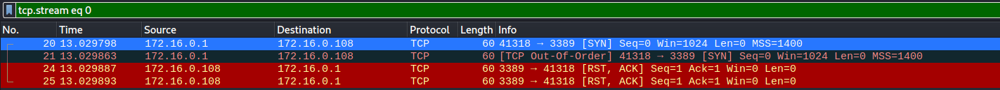
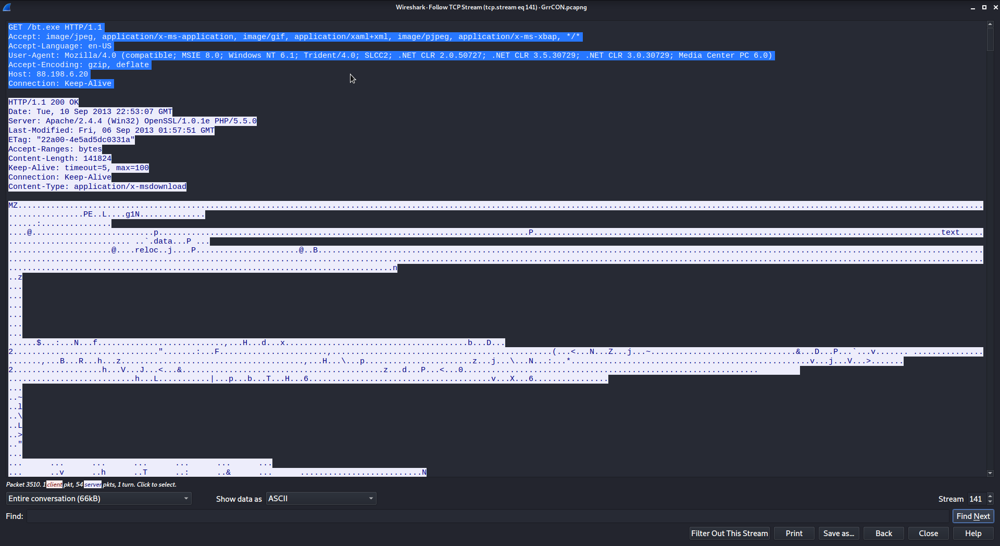

# Author: Panagiotis Fiskilis/Neuro #

## Challenge name:CyberDefenders:l337 S4uc3 ##

### Description: ###

```
Everyone has heard of targeted attacks. Detecting these can be challenging, responding to these can be even more challenging. This scenario will test your network and host-based analysis skills to figure out the who, what, where, when, and how of this incident. There is sure to be something for all skill levels and the only thing you need to solve the challenge is some l337 S4uc3!
```

#### Pcap Enumeration: ####

We also converted the pcapng file to a pcap file to open it in <code>Network Miner</code>

All IPs:


#### Memory Enumeration: ####

```bash
strings webserver.vmss  |grep "Linux" |grep "Ubuntu"
```


```
Linux 2.6.32-38-generic x86_64 Ubuntu
```

```bash
git clone https://github.com/volatilityfoundation/volatility.git
cp DFIRwebsvr.zip volatility/volatility/plugins/overlays/linux/
python2 volatility/vol.py --info |grep "DFIRwebsvr"
git clone https://github.com/Panagiotis-INS/AutoVolatility.git
#We change the volatility path inside the AutoVolatility script
AutoVolatility/AutoVol.sh --info |grep "DFIRwebsvr"
AutoVolatility/AutoVol.sh --profile=LinuxDFIRwebsvrx64 -f ./webserver.vmss
```

# Flags: #

- Flag 1:```74.204.41.73```


- Flag 2:```22:51:07 UTC```

- Flag 3:```5.3.2```


- Flag 4:```2.2.14```


- Flag 5:```zeus```


- Flag 6:```172.16.0.1```

With some experience we can see that this IP ends with 1 so it is possibly a router or a gateway

Also we see a lot of tcp retransmitted packets



- Flag 7:```74.125.225.112```


- Flag 8:```88.198.6.20```

We have 2 cases were this IP has tried to steal and send 'nefarious' files





- Flag 9:```cf.bin```

Look at previous flag evidence

- Flag 10:```wM812ugu```


- Flag 11:```23:04:04 UTC```


- Flag 12:```39709```

```bash
tshark -r  GrrCON.pcapng |grep "31708"
```


- Flag 13:```2.6.32-38-server```

```
tcp.stream eq 155
```


- Flag 14:```b7aad621db97d56771d6316a6d0b71e9```

TCP.stream -eq 150


- Flag 15:```wget```

Every Linux user ever

- Flag 16:```bt.exe```

tcp.stream eq 141


- Flag 17:```/bin/sh```

```bash
AutoVolatility/AutoVol.sh --profile=LinuxDFIRwebsvrx64 -f ./webserver.vmss
cat LinuxDFIRwebsvrx64_linux_pstree.log
```


- Flag 18:```1042```

Use the screenshot from previous flag

- Flag 19:```0```

We used volshell with normal volatility2

- Flag 20:```/bin/dash```

```bash
python2 volatility/vol.py --profile=LinuxDFIRwebsvrx64 -f ./webserver.vmss linux_proc_maps -p 1274
```


- Flag 21:```184c8748cfcfe8c0e24d7d80cac6e9bd```

```bash
mkdir dump
python2 volatility/vol.py --profile=LinuxDFIRwebsvrx64 -f ./webserver.vmss linux_pkt_queues -D dump
md5sum dump/receive.1105.3
```


