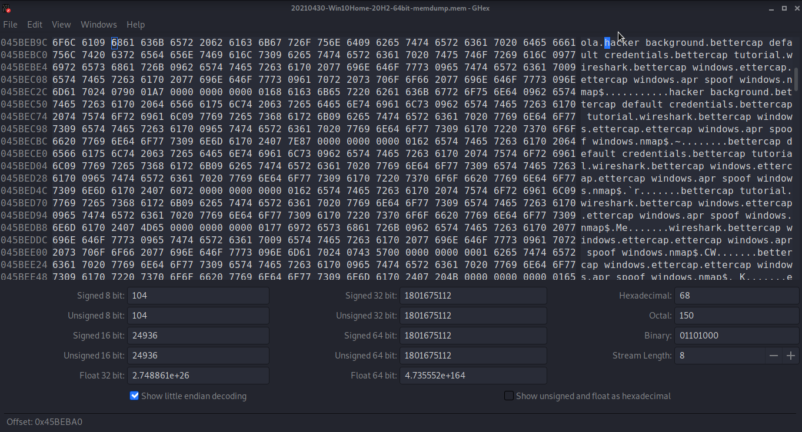

# Author: Panagiotis Fiskilis/Neuro

# Challenge name: CyberDefenders: Brave

## Description: ##

```
A memory image was taken from a seized Windows machine. Analyze the image and answer the provided questions.
```

## Solution: ##

We start with some basic housekeeping and enumeration 

```bash
volatility -f 20210430-Win10Home-20H2-64bit-memdump.mem imageinfo
volatility -f 20210430-Win10Home-20H2-64bit-memdump.mem --profile=Win10x64_19041 pslist |tee pslist.log
volatility -f 20210430-Win10Home-20H2-64bit-memdump.mem --profile=Win10x64_19041 pstree |tee pstree.log
volatility -f 20210430-Win10Home-20H2-64bit-memdump.mem --profile=Win10x64_19041 cmdline |tee cmdline.log
volatility -f 20210430-Win10Home-20H2-64bit-memdump.mem --profile=Win10x64_19041 cmdscan |tee cmdscan.log
volatility -f 20210430-Win10Home-20H2-64bit-memdump.mem --profile=Win10x64_19041 consoles |tee consoles.log
```

**Note:**

```--profile=Win10x64_19041```

# Flags:

- Flag1:2021-04-30 17:52:19

```bash
volatility -f 20210430-Win10Home-20H2-64bit-memdump.mem --profile=Win10x64_19041 timeliner |tee timeliner.log
cat timeliner.log |grep "^2021" |grep "..:..:19"
```

- Flag2:9db01b1e7b19a3b2113bfb65e860fffd7a1630bdf2b18613d206ebf2aa0ea172

```bash
sha256sum 20210430-Win10Home-20H2-64bit-memdump.mem
```

- Flag3:4856

```bash
cat pstree.log |grep -i "brave"
```

- Flag4:10

```bash
volatility -f 20210430-Win10Home-20H2-64bit-memdump.mem --profile=Win10x64_19041 netscan |tee netscan.log
cat netscan.log 
```

Search for the <code>ESTABLISHED</code> keyword inside the log file and then count the lines under it

- Flag5:mail.protonmail.com

```bash
volatility --plugin=/opt/volatility/volatility/plugins -f 20210430-Win10Home-20H2-64bit-memdump.mem --profile=Win10x64_19041 chromehistory |tee chromehistory.log
strings chromehistory.log |grep "https://" |grep "com"
```

- Flag6:

```bash
mkdir dump
volatility -f 20210430-Win10Home-20H2-64bit-memdump.mem --profile=Win10x64_19041 memdump -p 6988 -D dump
md5sum dump/6988.dmp
```

- Flag7:hacker

We used <code>Ghex</code> and got the flag



- Flag8:2021-04-30 17:39:48

```bash
cat pstree |grep "powershell" #get the ppid of powershell:4352
cat pstree |grep "4352"
```

- Flag9:C:\Users\JOHNDO~1\AppData\Local\Temp\7zO4FB31F24\accountNum

```bash
cat cmdline.log |grep -i "notepad"
```

- Flag10:

```bash
cat timeliner.log |grep "brave"

```
